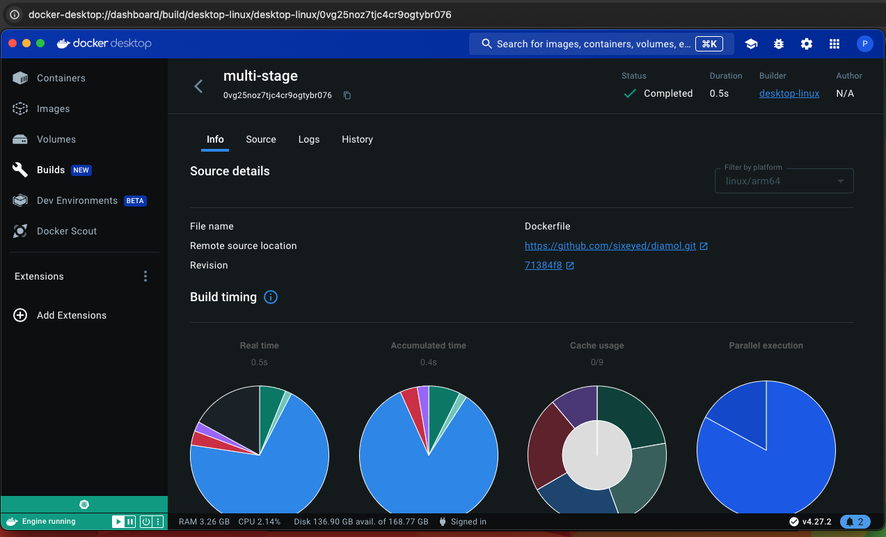

# Info
This is code and output from examples in the book.

# Get where I need to be locally:
`cd GitHub`

# Chapter 1: Before you begin
## Section 1.3: Creating your lab environment

```bash
λ docker version
Client:
 Cloud integration: v1.0.35+desktop.10
 Version:           25.0.2
 API version:       1.44
 Go version:        go1.21.6
 Git commit:        29cf629
 Built:             Thu Feb  1 00:18:45 2024
 OS/Arch:           darwin/arm64
 Context:           desktop-linux

Server: Docker Desktop 4.27.1 (136059)
 Engine:
  Version:          25.0.2
  API version:      1.44 (minimum version 1.24)
  Go version:       go1.21.6
  Git commit:       fce6e0c
  Built:            Thu Feb  1 00:23:21 2024
  OS/Arch:          linux/arm64
  Experimental:     false
 containerd:
  Version:          1.6.28
  GitCommit:        ae07eda36dd25f8a1b98dfbf587313b99c0190bb
 runc:
  Version:          1.1.12
  GitCommit:        v1.1.12-0-g51d5e94
 docker-init:
  Version:          0.19.0
  GitCommit:        de40ad0

λ docker-compose version
Docker Compose version v2.24.3-desktop.1
```

Trying on Windows:
```CMD
C:\Users\paulk\GitHub>docker version
Client:
 Cloud integration: v1.0.35+desktop.11
 Version:           25.0.3
 API version:       1.44
 Go version:        go1.21.6
 Git commit:        4debf41
 Built:             Tue Feb  6 21:13:02 2024
 OS/Arch:           windows/amd64
 Context:           default

Server: Docker Desktop 4.28.0 (139021)
 Engine:
  Version:          25.0.3
  API version:      1.44 (minimum version 1.24)
  Go version:       go1.21.6
  Git commit:       f417435
  Built:            Tue Feb  6 21:14:25 2024
  OS/Arch:          linux/amd64
  Experimental:     false
 containerd:
  Version:          1.6.28
  GitCommit:        ae07eda36dd25f8a1b98dfbf587313b99c0190bb
 runc:
  Version:          1.1.12
  GitCommit:        v1.1.12-0-g51d5e94
 docker-init:
  Version:          0.19.0
  GitCommit:        de40ad0
```

Ran `docker container rm -f $(docker container ls -aq)` after reviewing using the inner command + looking at Docker Desktop. Output:
```
0abff2d96d5b
87ddbfc97279
15ae1467eab8
74b602815d30
142849ea21dd
7bc71307599e
f7df8cdbabdc
b9d81252bcb5
80a34ab51304
8df4b6fde6e7
e9f0244c2690
ee45b9251b22
a99bae8ab43a
4b294480cb4a
bcd1ae0ac831
c19de38e21ed
5219650380e7
3e57f1ae10f4
fb8fe1a98f91
f507bca644f6
b7c2cb298daf
7b314a636e60
c0f40a430f72
b313048204d1
9f7ddd4edfb4
a96a7a47d3b3
127dd3936288
041942d8aaef
```
Also just reset the Kube cluster & ran [the cleanup from that book's repo](https://github.com/paulkaefer/kiamol_code/blob/main/code/cleanup.md).

# Chapter 2: Understanding Docker and running Hello World
## Section 2.1: Running Hello World in a container

```
λ docker container run diamol/ch02-hello-diamol
Unable to find image 'diamol/ch02-hello-diamol:latest' locally
latest: Pulling from diamol/ch02-hello-diamol
941f399634ec: Pull complete 
93931504196e: Pull complete 
d7b1f3678981: Pull complete 
Digest: sha256:c4f45e04025d10d14d7a96df2242753b925e5c175c3bea9112f93bf9c55d4474
Status: Downloaded newer image for diamol/ch02-hello-diamol:latest
---------------------
Hello from Chapter 2!
---------------------
My name is:
e66928f48980
---------------------
Im running on:
Linux 6.6.12-linuxkit aarch64
---------------------
My address is:
inet addr:<redacted> Bcast:<redacted> Mask:255.255.0.0
---------------------
```

Run again:
```
---------------------
Hello from Chapter 2!
---------------------
My name is:
be0202fbc034
---------------------
Im running on:
Linux 6.6.12-linuxkit aarch64
---------------------
My address is:
inet addr:<redacted> Bcast:<redacted> Mask:255.255.0.0
---------------------
```
The IP addresses stayed the same.

...and on Windows:
```
C:\Users\paulk\GitHub\diamol>docker container run diamol/ch02-hello-diamol
Unable to find image 'diamol/ch02-hello-diamol:latest' locally
latest: Pulling from diamol/ch02-hello-diamol
31603596830f: Pull complete
93931504196e: Pull complete
d7b1f3678981: Pull complete
Digest: sha256:c4f45e04025d10d14d7a96df2242753b925e5c175c3bea9112f93bf9c55d4474
Status: Downloaded newer image for diamol/ch02-hello-diamol:latest
---------------------
Hello from Chapter 2!
---------------------
My name is:
94340ec4197a
---------------------
Im running on:
Linux 5.15.133.1-microsoft-standard-WSL2 x86_64
---------------------
My address is:
inet addr:172.17.0.2 Bcast:172.17.255.255 Mask:255.255.0.0

...

C:\Users\paulk\GitHub\diamol>docker container run diamol/ch02-hello-diamol
---------------------
Hello from Chapter 2!
---------------------
My name is:
967b94072646
---------------------
Im running on:
Linux 5.15.133.1-microsoft-standard-WSL2 x86_64
---------------------
My address is:
inet addr:172.17.0.2 Bcast:172.17.255.255 Mask:255.255.0.0
---------------------
```

## Section 2.2: So what is a container?

## Section 2.3: Connecting to a container like a remote computer

```bash
docker container run --interactive --tty diamol/base
```
Interactive output:
```
Unable to find image 'diamol/base:latest' locally
latest: Pulling from diamol/base
941f399634ec: Already exists 
716aca3e500c: Pull complete 
Digest: sha256:787fe221a14f46b55e224ea0436aca77d345c3ded400aaf6cd40125e247f35c7
Status: Downloaded newer image for diamol/base:latest
/ # hostname
bb4ca7368a7d
/ # date
Wed Feb 21 17:19:40 UTC 2024
/ # 
...
/ # ping paulkaefer.com
PING paulkaefer.com (45.55.201.68): 56 data bytes
64 bytes from 45.55.201.68: seq=0 ttl=63 time=69.511 ms
64 bytes from 45.55.201.68: seq=1 ttl=63 time=66.832 ms
64 bytes from 45.55.201.68: seq=2 ttl=63 time=65.552 ms
64 bytes from 45.55.201.68: seq=3 ttl=63 time=65.872 ms
64 bytes from 45.55.201.68: seq=4 ttl=63 time=64.640 ms
64 bytes from 45.55.201.68: seq=5 ttl=63 time=64.975 ms
64 bytes from 45.55.201.68: seq=6 ttl=63 time=73.681 ms
^C
--- paulkaefer.com ping statistics ---
7 packets transmitted, 7 packets received, 0% packet loss
round-trip min/avg/max = 64.640/67.294/73.681 ms
```
Similar on Windows, thanks to WSL2.

```bash
λ docker container ls
CONTAINER ID   IMAGE         COMMAND     CREATED              STATUS              PORTS     NAMES
bb4ca7368a7d   diamol/base   "/bin/sh"   About a minute ago   Up About a minute             zealous_curie

λ docker container top bb
UID                 PID                 PPID                C                   STIME               TTY                 TIME                CMD
root                15377               15359               0                   17:19               ?                   00:00:00            /bin/sh
```

I ran `docker container logs`, which had interesting output. It did show the command history above + the below (including text to the input; buffer overflow?). My bash prompt might have issues.
```
^[[24;5R^[[24;5R^[[24;5R^[[24;5R^[[24;5R^[[24;5R^[[24;5R^[[24;5R^[[24;5R
Wed Feb 21 11:21:58
~
paulkaefer ~ λ 4;5R4;5R4;5R4;5R4;5R4;5R4;5R4;5R4;5R
```

```bash
λ docker container inspect bb
[
    {
        "Id": "bb4ca7368a7d4f2d4bbf54e60f8ec62f9440d51263e76cb7c6127840fe0cbe3f",
        "Created": "2024-02-21T17:19:20.775801008Z",
        "Path": "/bin/sh",
        "Args": [],
        "State": {
            "Status": "running",
            "Running": true,
            "Paused": false,
            "Restarting": false,
            "OOMKilled": false,
            "Dead": false,
            "Pid": 15377,
            "ExitCode": 0,
            "Error": "",
            "StartedAt": "2024-02-21T17:19:21.011966675Z",
            "FinishedAt": "0001-01-01T00:00:00Z"
        },
        "Image": "sha256:e65ed3e91e579a862befe0d866ffe1e3377d64245c9e9fd82fffaf9e3c961f49",
        "ResolvConfPath": "/var/lib/docker/containers/bb4ca7368a7d4f2d4bbf54e60f8ec62f9440d51263e76cb7c6127840fe0cbe3f/resolv.conf",
        "HostnamePath": "/var/lib/docker/containers/bb4ca7368a7d4f2d4bbf54e60f8ec62f9440d51263e76cb7c6127840fe0cbe3f/hostname",
        "HostsPath": "/var/lib/docker/containers/bb4ca7368a7d4f2d4bbf54e60f8ec62f9440d51263e76cb7c6127840fe0cbe3f/hosts",
        "LogPath": "/var/lib/docker/containers/bb4ca7368a7d4f2d4bbf54e60f8ec62f9440d51263e76cb7c6127840fe0cbe3f/bb4ca7368a7d4f2d4bbf54e60f8ec62f9440d51263e76cb7c6127840fe0cbe3f-json.log",
        "Name": "/zealous_curie",
        "RestartCount": 0,
        "Driver": "overlay2",
        "Platform": "linux",
        "MountLabel": "",
        "ProcessLabel": "",
        "AppArmorProfile": "",
        "ExecIDs": null,
        "HostConfig": {
            "Binds": null,
            "ContainerIDFile": "",
            "LogConfig": {
                "Type": "json-file",
                "Config": {}
            },
            "NetworkMode": "default",
            "PortBindings": {},
            "RestartPolicy": {
                "Name": "no",
                "MaximumRetryCount": 0
            },
            "AutoRemove": false,
            "VolumeDriver": "",
            "VolumesFrom": null,
            "ConsoleSize": [
                24,
                80
            ],
            "CapAdd": null,
            "CapDrop": null,
            "CgroupnsMode": "private",
            "Dns": [],
            "DnsOptions": [],
            "DnsSearch": [],
            "ExtraHosts": null,
            "GroupAdd": null,
            "IpcMode": "private",
            "Cgroup": "",
            "Links": null,
            "OomScoreAdj": 0,
            "PidMode": "",
            "Privileged": false,
            "PublishAllPorts": false,
            "ReadonlyRootfs": false,
            "SecurityOpt": null,
            "UTSMode": "",
            "UsernsMode": "",
            "ShmSize": 67108864,
            "Runtime": "runc",
            "Isolation": "",
            "CpuShares": 0,
            "Memory": 0,
            "NanoCpus": 0,
            "CgroupParent": "",
            "BlkioWeight": 0,
            "BlkioWeightDevice": [],
            "BlkioDeviceReadBps": [],
            "BlkioDeviceWriteBps": [],
            "BlkioDeviceReadIOps": [],
            "BlkioDeviceWriteIOps": [],
            "CpuPeriod": 0,
            "CpuQuota": 0,
            "CpuRealtimePeriod": 0,
            "CpuRealtimeRuntime": 0,
            "CpusetCpus": "",
            "CpusetMems": "",
            "Devices": [],
            "DeviceCgroupRules": null,
            "DeviceRequests": null,
            "MemoryReservation": 0,
            "MemorySwap": 0,
            "MemorySwappiness": null,
            "OomKillDisable": null,
            "PidsLimit": null,
            "Ulimits": [],
            "CpuCount": 0,
            "CpuPercent": 0,
            "IOMaximumIOps": 0,
            "IOMaximumBandwidth": 0,
            "MaskedPaths": [
                "/proc/asound",
                "/proc/acpi",
                "/proc/kcore",
                "/proc/keys",
                "/proc/latency_stats",
                "/proc/timer_list",
                "/proc/timer_stats",
                "/proc/sched_debug",
                "/proc/scsi",
                "/sys/firmware",
                "/sys/devices/virtual/powercap"
            ],
            "ReadonlyPaths": [
                "/proc/bus",
                "/proc/fs",
                "/proc/irq",
                "/proc/sys",
                "/proc/sysrq-trigger"
            ]
        },
        "GraphDriver": {
            "Data": {
                "LowerDir": "/var/lib/docker/overlay2/6f24187df61842b971b710781646b3207f6b5f8ee91403bbd2cadb2e1b89ce1a-init/diff:/var/lib/docker/overlay2/e277e88cfdcdaebdd02dd62c6895317878989035b8bb4b4473a698cd1523a343/diff:/var/lib/docker/overlay2/b98b86a3f22ac5b8eea66b9839e5b6657501a5dbb4f478c2fec1e8885f4a4cc1/diff",
                "MergedDir": "/var/lib/docker/overlay2/6f24187df61842b971b710781646b3207f6b5f8ee91403bbd2cadb2e1b89ce1a/merged",
                "UpperDir": "/var/lib/docker/overlay2/6f24187df61842b971b710781646b3207f6b5f8ee91403bbd2cadb2e1b89ce1a/diff",
                "WorkDir": "/var/lib/docker/overlay2/6f24187df61842b971b710781646b3207f6b5f8ee91403bbd2cadb2e1b89ce1a/work"
            },
            "Name": "overlay2"
        },
        "Mounts": [],
        "Config": {
            "Hostname": "bb4ca7368a7d",
            "Domainname": "",
            "User": "",
            "AttachStdin": true,
            "AttachStdout": true,
            "AttachStderr": true,
            "Tty": true,
            "OpenStdin": true,
            "StdinOnce": true,
            "Env": [
                "PATH=/usr/local/sbin:/usr/local/bin:/usr/sbin:/usr/bin:/sbin:/bin"
            ],
            "Cmd": [
                "/bin/sh"
            ],
            "Image": "diamol/base",
            "Volumes": null,
            "WorkingDir": "",
            "Entrypoint": null,
            "OnBuild": null,
            "Labels": {}
        },
        "NetworkSettings": {
            "Bridge": "",
            "SandboxID": "739ec72efe5a05549f505f48e8f902ffdb99192ad34ae4ac07dc8f68d824ee7c",
            "SandboxKey": "/var/run/docker/netns/739ec72efe5a",
            "Ports": {},
            "HairpinMode": false,
            "LinkLocalIPv6Address": "",
            "LinkLocalIPv6PrefixLen": 0,
            "SecondaryIPAddresses": null,
            "SecondaryIPv6Addresses": null,
            "EndpointID": "4bbdb627b07eda724fa76e971f4a0a4cfd67891bbfeed29dcdb2ea1db48b955c",
            "Gateway": "172.17.0.1",
            "GlobalIPv6Address": "",
            "GlobalIPv6PrefixLen": 0,
            "IPAddress": "172.17.0.2",
            "IPPrefixLen": 16,
            "IPv6Gateway": "",
            "MacAddress": "02:42:ac:11:00:02",
            "Networks": {
                "bridge": {
                    "IPAMConfig": null,
                    "Links": null,
                    "Aliases": null,
                    "MacAddress": "02:42:ac:11:00:02",
                    "NetworkID": "f7c09f3a29a7af95bf3d3ff3d3ec658ea02fd992e495a85f674ab4ca6d5618c7",
                    "EndpointID": "4bbdb627b07eda724fa76e971f4a0a4cfd67891bbfeed29dcdb2ea1db48b955c",
                    "Gateway": "172.17.0.1",
                    "IPAddress": "172.17.0.2",
                    "IPPrefixLen": 16,
                    "IPv6Gateway": "",
                    "GlobalIPv6Address": "",
                    "GlobalIPv6PrefixLen": 0,
                    "DriverOpts": null,
                    "DNSNames": null
                }
            }
        }
    }
]
```

## Section 2.4: Hosting a website in a container
```bash
λ docker container ls --all
CONTAINER ID   IMAGE                      COMMAND                 CREATED          STATUS                      PORTS     NAMES
bb4ca7368a7d   diamol/base                "/bin/sh"               5 minutes ago    Exited (0) 19 seconds ago             zealous_curie
6f2c1e8ac1f8   diamol/ch02-hello-diamol   "/bin/sh -c ./cmd.sh"   11 minutes ago   Exited (0) 11 minutes ago             charming_meninsky
aa93dcb21074   diamol/ch02-hello-diamol   "/bin/sh -c ./cmd.sh"   11 minutes ago   Exited (0) 11 minutes ago             quirky_newton
be0202fbc034   diamol/ch02-hello-diamol   "/bin/sh -c ./cmd.sh"   12 minutes ago   Exited (0) 12 minutes ago             thirsty_albattani
e66928f48980   diamol/ch02-hello-diamol   "/bin/sh -c ./cmd.sh"   13 minutes ago   Exited (0) 13 minutes ago             romantic_hawking
```

```bash
λ docker container run --detach --publish 8088:80 diamol/ch02-hello-diamol-web
Unable to find image 'diamol/ch02-hello-diamol-web:latest' locally
latest: Pulling from diamol/ch02-hello-diamol-web
dce8679b510e: Pull complete 
c111552b26df: Pull complete 
ef4263ddbf41: Pull complete 
cac4170335ae: Pull complete 
0a26a833371b: Pull complete 
994988584430: Pull complete 
Digest: sha256:fe5a4c954fe2df5cadeea304ab632533f8ece9e31bd219ea22fdbf8b597571eb
Status: Downloaded newer image for diamol/ch02-hello-diamol-web:latest
d5e4da70f31d8490504781867f2c3db1bbf8070c6f59d01ec89ae13ecf4b6751
```

```bash
λ docker container ls
CONTAINER ID   IMAGE                          COMMAND              CREATED          STATUS          PORTS                  NAMES
d5e4da70f31d   diamol/ch02-hello-diamol-web   "httpd-foreground"   20 seconds ago   Up 19 seconds   0.0.0.0:8088->80/tcp   romantic_wescoff
```
It works! At `http://localhost:8088`, I see:

> Hello from Chapter 2!
> This is [Learn Docker in a Month of Lunches](https://www.manning.com/books/learn-docker-in-a-month-of-lunches).

Running `docker container stats`:
```
CONTAINER ID   NAME               CPU %     MEM USAGE / LIMIT     MEM %     NET I/O           BLOCK I/O    PIDS
d5e4da70f31d   romantic_wescoff   0.00%     4.668MiB / 8.726GiB   0.05%     3.85kB / 1.97kB   0B / 4.1kB   82
```

Cleanup:
```bash
Wed Feb 21 11:30:37
~/GitHub/diamol/ch02
paulkaefer ~/GitHub/diamol/ch02 λ docker container rm d5e4da70f31d
Error response from daemon: cannot remove container "/romantic_wescoff": container is running: stop the container before removing or force remove

Wed Feb 21 11:30:40
~/GitHub/diamol/ch02
paulkaefer ~/GitHub/diamol/ch02 λ docker container rm --force d5e4da70f31d
d5e4da70f31d

λ docker container rm --force $(docker container ls --all --quiet)
bb4ca7368a7d
6f2c1e8ac1f8
aa93dcb21074
be0202fbc034
e66928f48980
```
Worked on PowerShell, but not cmd.exe.

## Section 2.5: Understanding how Docker runs containers

## Chapter 2 Lab
```
docker container run --detach --publish 8088:80 diamol/ch02-hello-diamol-web
```

My work:
```bash
λ docker container run --detach --publish 8088:80 diamol/ch02-hello-diamol-web
b02396891985eed71002f3cc504aeba05b3380d84ccf8b5215e1f47e32146de9
```
Ah, this didn't work because I changed the file locally, but this pulls from docker hub.

Following the README:
```bash
λ docker container exec b02  ls /usr/local/apache2/htdocs
index.html
λ docker container cp index.html b02:/usr/local/apache2/htdocs/index.html
Successfully copied 2.05kB to b02:/usr/local/apache2/htdocs/index.html
```

# Chapter 3: Building your own Docker images

## Section 3.1: Using a container image from Docker Hub
[Image](https://hub.docker.com/r/diamol/ch03-web-ping) that pings the author's blog:
```bash
docker image pull diamol/ch03-web-ping
```
Output:
```
Using default tag: latest
latest: Pulling from diamol/ch03-web-ping
0362ad1dd800: Pull complete 
b09a182c47e8: Pull complete 
39d61d2ed871: Pull complete 
b4e2115e274a: Pull complete 
f5cca017994f: Pull complete 
f504555623f6: Pull complete 
Digest: sha256:2f2dce710a7f287afc2d7bbd0d68d024bab5ee37a1f658cef46c64b1a69affd2
Status: Downloaded newer image for diamol/ch03-web-ping:latest
docker.io/diamol/ch03-web-ping:latest
```

```bash
docker container run -d --name web-ping diamol/ch03-web-ping
```
Output:
```
e81a0297a124fa7a8fd01c199b54d99b5a7738a98b59fe4219959170913cf11c
```

Running `docker container logs web-ping` shows that it is running the pings.

```bash
λ docker rm -f web-ping
web-ping
λ docker container run --env TARGET=google.com diamol/ch03-web-ping
** web-ping ** Pinging: google.com; method: HEAD; 3000ms intervals
Making request number: 1; at 1708613920449
...
```

## Section 3.2: Writing your first Dockerfile
Explained files in `~/GitHub/diamol/ch03/exercises/web-ping` (except for `Jenkinsfile`).

## Section 3.3: Building your own container image

```bash
docker image build --tag web-ping .
```
Output:
```
[+] Building 1.9s (9/9) FINISHED                           docker:desktop-linux
 => [internal] load build definition from Dockerfile                       0.0s
 => => transferring dockerfile: 190B                                       0.0s
 => [internal] load metadata for docker.io/diamol/node:latest              1.7s
 => [auth] diamol/node:pull token for registry-1.docker.io                 0.0s
 => [internal] load .dockerignore                                          0.0s
 => => transferring context: 2B                                            0.0s
 => [1/3] FROM docker.io/diamol/node:latest@sha256:dfee522acebdfdd9964aa9  0.0s
 => => resolve docker.io/diamol/node:latest@sha256:dfee522acebdfdd9964aa9  0.0s
 => => sha256:dfee522acebdfdd9964aa9c88ebebd03a20b6dd5739 1.41kB / 1.41kB  0.0s
 => => sha256:6467efe6481aace0c317f144079c1a321b91375a828 1.16kB / 1.16kB  0.0s
 => => sha256:8e0eeb0a11b3a91cc1d91b5ef637edd153a64a3792e 5.66kB / 5.66kB  0.0s
 => [internal] load build context                                          0.0s
 => => transferring context: 881B                                          0.0s
 => [2/3] WORKDIR /web-ping                                                0.0s
 => [3/3] COPY app.js .                                                    0.0s
 => exporting to image                                                     0.0s
 => => exporting layers                                                    0.0s
 => => writing image sha256:fa972ea9b32ed16dcb9966ae48a05b8aa2e8ea62a0a65  0.0s
 => => naming to docker.io/library/web-ping                                0.0s

View build details: docker-desktop://dashboard/build/desktop-linux/desktop-linux/zg3g2t6nw6vjdazfm5oi29hwl
```
No “successfully built” and “successfully tagged” messages (mentioned in the text), but (1) it says `FINISHED` and (2) no errors.

```bash
λ docker image ls 'w*'
REPOSITORY   TAG       IMAGE ID       CREATED              SIZE
web-ping     latest    fa972ea9b32e   About a minute ago   75.5MB
```

Running it...
```bash
docker container run -e TARGET=docker.com -e INTERVAL=5000 web-ping
# works; the below will ping my website:
docker container run -e INTERVAL=5000 web-ping
```

## Section 3.4: Understanding Docker images and image layers
```bash
λ docker image history web-ping
IMAGE          CREATED         CREATED BY                                      SIZE      COMMENT
fa972ea9b32e   4 minutes ago   CMD ["node" "/web-ping/app.js"]                 0B        buildkit.dockerfile.v0
<missing>      4 minutes ago   COPY app.js . # buildkit                        846B      buildkit.dockerfile.v0
<missing>      4 minutes ago   WORKDIR /web-ping                               0B        buildkit.dockerfile.v0
<missing>      4 minutes ago   ENV INTERVAL=3000                               0B        buildkit.dockerfile.v0
<missing>      4 minutes ago   ENV METHOD=HEAD                                 0B        buildkit.dockerfile.v0
<missing>      4 minutes ago   ENV TARGET=paulkaefer.com                       0B        buildkit.dockerfile.v0
<missing>      4 years ago     /bin/sh -c #(nop)  CMD ["node"]                 0B        
<missing>      4 years ago     /bin/sh -c #(nop)  ENTRYPOINT ["docker-entry…   0B        
<missing>      4 years ago     /bin/sh -c #(nop) COPY file:238737301d473041…   116B      
<missing>      4 years ago     /bin/sh -c apk add --no-cache --virtual .bui…   5.11MB    
<missing>      4 years ago     /bin/sh -c #(nop)  ENV YARN_VERSION=1.16.0      0B        
<missing>      4 years ago     /bin/sh -c addgroup -g 1000 node     && addu…   65.1MB    
<missing>      4 years ago     /bin/sh -c #(nop)  ENV NODE_VERSION=10.16.0     0B        
<missing>      4 years ago     /bin/sh -c #(nop)  CMD ["/bin/sh"]              0B        
<missing>      4 years ago     /bin/sh -c #(nop) ADD file:66f49017dd7ba2956…   5.29MB
```
The `238737301d473041…` is mentioned @ `ch03-web-ping` on Docker Hub.

```bash
λ docker image ls
REPOSITORY                                                       TAG                                                                          IMAGE ID       CREATED         SIZE
web-ping                                                         latest                                                                       fa972ea9b32e   2 hours ago     75.5MB
kiamol/ch21-kubeless-cli                                         latest                                                                       df1324156b4f   10 days ago     996MB
kiamol/ch20-todo-save-handler                                    latest                                                                       ce87fd0b26d4   10 days ago     216MB
kiamol/ch20-todo-list                                            latest                                                                       009df9cedb42   10 days ago     234MB
kiamol/ch21-kubeless-cli                                         <none>                                                                       c4054264eaed   2 weeks ago     996MB
kiamol/ch20-todo-save-handler                                    <none>                                                                       a343f3a9079e   2 weeks ago     216MB
kiamol/ch20-todo-list                                            <none>                                                                       dc7144c8aa94   2 weeks ago     234MB
kiamol/ch20-user-controller                                      latest                                                                       13d234589d5f   2 weeks ago     95.9MB
meta<redacted>                                                   latest                                                                       8c43........   2 weeks ago     934MB
docker/desktop-kubernetes                                        kubernetes-v1.29.1-cni-v1.4.0-critools-v1.29.0-cri-dockerd-v0.3.8-1-debian   e953cb83dd7e   4 weeks ago     422MB
registry.k8s.io/kube-apiserver                                   v1.29.1                                                                      f3b81ff188c6   5 weeks ago     123MB
registry.k8s.io/kube-proxy                                       v1.29.1                                                                      b125ba1d1878   5 weeks ago     85.4MB
registry.k8s.io/kube-controller-manager                          v1.29.1                                                                      8715bb0e3bc2   5 weeks ago     118MB
registry.k8s.io/kube-scheduler                                   v1.29.1                                                                      140ecfd0789f   5 weeks ago     58MB
ts_metadata_exports                                              latest                                                                       80b220c973a2   3 months ago    276MB
registry.k8s.io/etcd                                             3.5.10-0                                                                     79f8d13ae8b8   3 months ago    136MB
hubproxy.docker.internal:5555/docker/desktop-kubernetes          kubernetes-v1.28.2-cni-v1.3.0-critools-v1.28.0-cri-dockerd-v0.3.4-1-debian   19d261e62622   4 months ago    411MB
registry.k8s.io/kube-apiserver                                   v1.28.2                                                                      30bb499447fe   5 months ago    120MB
registry.k8s.io/kube-controller-manager                          v1.28.2                                                                      89d57b83c178   5 months ago    116MB
registry.k8s.io/kube-scheduler                                   v1.28.2                                                                      64fc40cee371   5 months ago    57.8MB
registry.k8s.io/kube-proxy                                       v1.28.2                                                                      7da62c127fc0   5 months ago    68.3MB
registry.k8s.io/coredns/coredns                                  v1.11.1                                                                      2437cf762177   6 months ago    57.4MB
hubproxy.docker.internal:5555/docker/desktop-kubernetes          kubernetes-v1.27.2-cni-v1.2.0-critools-v1.27.0-cri-dockerd-v0.3.2-1-debian   8ba658ef36dd   8 months ago    398MB
registry.k8s.io/kube-apiserver                                   v1.27.2                                                                      72c9df6be7f1   9 months ago    115MB
registry.k8s.io/kube-scheduler                                   v1.27.2                                                                      305d7ed1dae2   9 months ago    56.2MB
registry.k8s.io/kube-controller-manager                          v1.27.2                                                                      2ee705380c3c   9 months ago    107MB
registry.k8s.io/kube-proxy                                       v1.27.2                                                                      29921a084542   9 months ago    66.5MB
registry.k8s.io/etcd                                             3.5.9-0                                                                      9cdd6470f48c   9 months ago    181MB
docker/desktop-vpnkit-controller                                 dc331cb22850be0cdd97c84a9cfecaf44a1afb6e                                     3750dfec169f   9 months ago    35MB
hubproxy.docker.internal:5555/docker/desktop-kubernetes          kubernetes-v1.25.9-cni-v1.1.1-critools-v1.25.0-cri-dockerd-v0.2.6-1-debian   72db983f29ff   10 months ago   385MB
registry.k8s.io/kube-apiserver                                   v1.25.9                                                                      b781b2ba4d81   10 months ago   123MB
registry.k8s.io/kube-controller-manager                          v1.25.9                                                                      97b0bebd519d   10 months ago   113MB
registry.k8s.io/kube-proxy                                       v1.25.9                                                                      7d06ab3388e9   10 months ago   58.1MB
registry.k8s.io/kube-scheduler                                   v1.25.9                                                                      591d2f8e126e   10 months ago   49.4MB
registry.k8s.io/coredns/coredns                                  v1.10.1                                                                      97e04611ad43   12 months ago   51.4MB
registry.k8s.io/etcd                                             3.5.7-0                                                                      24bc64e91103   13 months ago   181MB
hubproxy.docker.internal:5000/docker/desktop-kubernetes          kubernetes-v1.25.4-cni-v1.1.1-critools-v1.25.0-cri-dockerd-v0.2.6-1-debian   54fd0a8aabc0   14 months ago   383MB
hubproxy.docker.internal:5555/docker/desktop-kubernetes          kubernetes-v1.25.4-cni-v1.1.1-critools-v1.25.0-cri-dockerd-v0.2.6-1-debian   54fd0a8aabc0   14 months ago   383MB
registry.k8s.io/etcd                                             3.5.6-0                                                                      ef2458028240   15 months ago   181MB
registry.k8s.io/kube-apiserver                                   v1.25.4                                                                      8e49cdf98f4d   15 months ago   123MB
registry.k8s.io/kube-scheduler                                   v1.25.4                                                                      0d46ff411d67   15 months ago   49.3MB
registry.k8s.io/kube-proxy                                       v1.25.4                                                                      754f6cdb0cbb   15 months ago   58MB
registry.k8s.io/kube-controller-manager                          v1.25.4                                                                      829662131775   15 months ago   113MB
registry.k8s.io/pause                                            3.9                                                                          829e9de338bd   16 months ago   514kB
hubproxy.docker.internal:5000/docker/desktop-kubernetes          kubernetes-v1.25.2-cni-v1.1.1-critools-v1.24.2-cri-dockerd-v0.2.5-1-debian   181339469f74   17 months ago   349MB
k8s.gcr.io/kube-apiserver                                        v1.25.2                                                                      0b1fb9b45fa3   17 months ago   123MB
k8s.gcr.io/kube-proxy                                            v1.25.2                                                                      68348500321c   17 months ago   58MB
k8s.gcr.io/kube-controller-manager                               v1.25.2                                                                      c6c296d44024   17 months ago   113MB
k8s.gcr.io/kube-scheduler                                        v1.25.2                                                                      873dc124ec69   17 months ago   49.3MB
kubernetesui/dashboard                                           v2.7.0                                                                       20b332c9a70d   17 months ago   244MB
registry.k8s.io/etcd                                             3.5.5-0                                                                      b9a1dfeddea9   17 months ago   179MB
kiamol/ch11-gogs                                                 latest                                                                       1785843863ee   17 months ago   103MB
kiamol/ch04-todo-list                                            latest                                                                       130d01894885   17 months ago   137MB
kiamol/ch03-numbers-web                                          latest                                                                       02ceb290312a   17 months ago   115MB
kiamol/ch03-numbers-api                                          latest                                                                       e1e7fbeb1eba   17 months ago   111MB
kiamol/ch02-whoami                                               latest                                                                       73906425ea05   18 months ago   111MB
kiamol/ch17-user-cert-generator                                  latest                                                                       3a29180d53fb   18 months ago   54.8MB
kiamol/ch17-todo-list-configurator                               latest                                                                       35649eefd455   18 months ago   53MB
kiamol/ch17-rbac-tools                                           latest                                                                       0778797b0091   18 months ago   98.6MB
kiamol/ch17-kube-explorer                                        latest                                                                       2b2e74ebe041   18 months ago   141MB
hubproxy.docker.internal:5000/docker/desktop-kubernetes          kubernetes-v1.25.0-cni-v1.1.1-critools-v1.24.2-cri-dockerd-v0.2.5-1-debian   bf50bf323fa3   18 months ago   349MB
k8s.gcr.io/kube-apiserver                                        v1.25.0                                                                      4a10a2c929d5   18 months ago   123MB
k8s.gcr.io/kube-controller-manager                               v1.25.0                                                                      35cb04d93081   18 months ago   113MB
k8s.gcr.io/kube-proxy                                            v1.25.0                                                                      f5e24e0ab5f8   18 months ago   58MB
k8s.gcr.io/kube-scheduler                                        v1.25.0                                                                      b933d73979ff   18 months ago   49.3MB
kiamol/ch03-numbers-web                                          v2                                                                           c294735f79f1   19 months ago   115MB
kiamol/ch15-cert-generator                                       latest                                                                       0a14ce81da98   20 months ago   53.6MB
kiamol/ch09-vweb                                                 v1                                                                           ec739aa9e4e2   20 months ago   22MB
kiamol/ch09-vweb                                                 v2                                                                           0d24f8a89765   20 months ago   22MB
kiamol/ch07-timecheck                                            latest                                                                       4bdd7b80676f   20 months ago   88.6MB
kiamol/ch07-simple-proxy                                         latest                                                                       76e0b841f2c0   20 months ago   92.9MB
kiamol/ch05-pi                                                   latest                                                                       0392193fe9c4   20 months ago   116MB
kiamol/ch02-hello-kiamol                                         latest                                                                       f648c1ff0b2b   20 months ago   22MB
hubproxy.docker.internal:5000/docker/desktop-kubernetes          kubernetes-v1.24.2-cni-v1.1.1-critools-v1.24.2-cri-dockerd-v0.2.1-1-debian   476af46fb131   20 months ago   353MB
k8s.gcr.io/pause                                                 3.8                                                                          4e42fb3c9d90   20 months ago   514kB
registry.k8s.io/pause                                            3.8                                                                          4e42fb3c9d90   20 months ago   514kB
k8s.gcr.io/kube-apiserver                                        v1.24.2                                                                      21a90cbceae7   20 months ago   126MB
k8s.gcr.io/kube-controller-manager                               v1.24.2                                                                      cbadad6da5e7   20 months ago   116MB
k8s.gcr.io/kube-proxy                                            v1.24.2                                                                      4f5059b7cbd8   20 months ago   106MB
k8s.gcr.io/kube-scheduler                                        v1.24.2                                                                      25034e073eab   20 months ago   50MB
k8s.gcr.io/etcd                                                  3.5.4-0                                                                      8e041a3b0ba8   21 months ago   179MB
kubernetesui/metrics-scraper                                     v1.0.8                                                                       a422e0e98235   21 months ago   42.3MB
hubproxy.docker.internal:5000/docker/desktop-kubernetes          kubernetes-v1.24.1-cni-v0.8.5-critools-v1.24.2-cri-dockerd-v0.2.1-1-debian   f0446f591051   21 months ago   350MB
k8s.gcr.io/coredns                                               v1.9.3                                                                       b19406328e70   21 months ago   47.7MB
registry.k8s.io/coredns/coredns                                  v1.9.3                                                                       b19406328e70   21 months ago   47.7MB
k8s.gcr.io/kube-apiserver                                        v1.24.1                                                                      7c5896a75862   21 months ago   126MB
k8s.gcr.io/kube-proxy                                            v1.24.1                                                                      fcbd620bbac0   21 months ago   106MB
k8s.gcr.io/kube-controller-manager                               v1.24.1                                                                      f61bbe9259d7   21 months ago   116MB
k8s.gcr.io/kube-scheduler                                        v1.24.1                                                                      000c19baf6bb   21 months ago   50MB
hubproxy.docker.internal:5000/docker/desktop-kubernetes          kubernetes-v1.24.0-cni-v0.8.5-critools-v1.17.0-cri-dockerd-v0.2.0-1-debian   44b0e7b8434b   21 months ago   337MB
k8s.gcr.io/kube-apiserver                                        v1.24.0                                                                      b62a103951f4   22 months ago   126MB
k8s.gcr.io/kube-controller-manager                               v1.24.0                                                                      59fad34d4fe0   22 months ago   116MB
k8s.gcr.io/kube-proxy                                            v1.24.0                                                                      66e1443684b0   22 months ago   106MB
k8s.gcr.io/kube-scheduler                                        v1.24.0                                                                      b81513b3bfb4   22 months ago   50MB
k8s.gcr.io/etcd                                                  3.5.3-0                                                                      a9a710bb96df   22 months ago   178MB
kiamol/ch14-image-gallery                                        latest                                                                       cedb4dededc9   22 months ago   17.5MB
kiamol/ch09-vweb                                                 v3                                                                           a69cef12396a   22 months ago   5.32MB
k8s.gcr.io/pause                                                 3.7                                                                          e5a475a03805   23 months ago   514kB
gcr.io/k8s-minikube/kicbase                                      v0.0.29                                                                      c3fce30d7a06   2 years ago     1.04GB
kiamol/ch14-image-of-the-day                                     latest                                                                       cc6eb70b3efb   2 years ago     236MB
kiamol/ch14-access-log                                           latest                                                                       b58587fa8448   2 years ago     128MB
kiamol/ch13-kibana                                               latest                                                                       d6414d8b6548   2 years ago     361MB
kiamol/ch13-elasticsearch                                        latest                                                                       68115ced5cc1   2 years ago     337MB
kiamol/ch10-web-ping                                             latest                                                                       ffae50e822a6   2 years ago     111MB
k8s.gcr.io/kube-apiserver                                        v1.22.5                                                                      66ba38aa55f7   2 years ago     119MB
k8s.gcr.io/kube-proxy                                            v1.22.5                                                                      d665e23ad35c   2 years ago     97.4MB
k8s.gcr.io/kube-controller-manager                               v1.22.5                                                                      fc9438491212   2 years ago     113MB
k8s.gcr.io/kube-scheduler                                        v1.22.5                                                                      ecf6859f4d39   2 years ago     49.3MB
fluent/fluent-bit                                                1.8.11                                                                       f7255a4c349b   2 years ago     166MB
k8s.gcr.io/coredns/coredns                                       v1.8.6                                                                       edaa71f2aee8   2 years ago     46.8MB
k8s.gcr.io/etcd                                                  3.5.0-0                                                                      2252d5eb703b   2 years ago     364MB
k8s.gcr.io/coredns/coredns                                       v1.8.4                                                                       6d3ffc2696ac   2 years ago     44.4MB
docker/desktop-vpnkit-controller                                 v2.0                                                                         2edf9c994f19   2 years ago     19.2MB
docker/desktop-storage-provisioner                               v2.0                                                                         c027a58fa0bb   2 years ago     39.8MB
nginx                                                            1.18-alpine                                                                  f4ab10c6f38e   2 years ago     20.5MB
k8s.gcr.io/pause                                                 3.5                                                                          f7ff3c404263   2 years ago     484kB
diamol/ch02-hello-diamol-web                                     latest                                                                       40ba417b2294   2 years ago     54.6MB
diamol/base                                                      latest                                                                       e65ed3e91e57   2 years ago     6.89MB
adminer                                                          4.7-standalone                                                               784bd3608a38   3 years ago     79.8MB
diamol/ch03-web-ping                                             latest                                                                       bfce5d697312   3 years ago     75.5MB
diamol/ch02-hello-diamol                                         latest                                                                       c65623b61864   3 years ago     5.3MB
kubeless/function-controller                                     v1.0.7                                                                       94e7c07e8bd3   3 years ago     85.3MB
postgres                                                         11.8-alpine                                                                  c1280c34ec99   3 years ago     154MB
quay.io/kubernetes-ingress-controller/nginx-ingress-controller   0.33.0                                                                       ab6277d9d07e   3 years ago     322MB
connecteverything/nats-operator                                  0.7.2                                                                        cbd9274b401d   3 years ago     44.3MB
nginx                                                            1.17-alpine                                                                  377eb1b97ee5   3 years ago     18.9MB
moby/buildkit                                                    v0.7.1                                                                       619d0bf5fa9f   3 years ago     78.6MB
chartmuseum/chartmuseum                                          v0.12.0                                                                      723ca60d48e9   3 years ago     63.5MB
postgres                                                         11.6-alpine                                                                  94d455984111   4 years ago     150MB
kubeless/http-trigger-controller                                 v1.0.1                                                                       d6f09f3299d9   4 years ago     83.4MB
kubeless/cronjob-trigger-controller                              v1.0.1                                                                       aec1dd30bb57   4 years ago     77.1MB
```

Cool that my `web-ping`/`diamol/ch03-web-ping` are using 75.5MB, roughly what the author's screenshot shows.

```bash
λ docker system df
TYPE            TOTAL     ACTIVE    SIZE      RECLAIMABLE
Images          128       14        16.59GB   14.96GB (90%)
Containers      41        20        585.7kB   213B (0%)
Local Volumes   2         2         11.75MB   0B (0%)
Build Cache     52        0         59.74MB   59.74MB
```

Nice!

## Section 3.5: Optimizing Dockerfiles to use the image layer cache

```bash
cd ../web-ping-optimized
docker image build -t web-ping:v3 .
```
One observation is that I (still) don't see the seven steps as mentioned. Might be the newest Docker working differently than the version the author used.


## Chatper 3 Lab
1. pull `diamol/ch03-lab` from Docker Hub; actually just run the command in step 2, as it should pull as well.
```bash
docker container run diamol/ch03-lab
```
2. ssh into it to look at `/diamol/ch03.txt`
```bash
docker container run --interactive --tty diamol/ch03-lab
```
Output:
```
Unable to find image 'diamol/ch03-lab:latest' locally
latest: Pulling from diamol/ch03-lab
941f399634ec: Already exists 
716aca3e500c: Already exists 
d347025eebd3: Pull complete 
c55b6ee61343: Pull complete 
Digest: sha256:161fc42d4a6ea122e2534e884a7ef7c737433e4aa098ba0523816e63f39e05c2
Status: Downloaded newer image for diamol/ch03-lab:latest
/diamol #
```
3. edit a version of the file locally
```
/diamol # cat ch03.txt 
Lab solution, by: 
```
4. copy it in? or is there a way to just create an image...
```bash
docker container ls --all
docker container cp ch03.txt d9:/diamol/ch03.txt
```
Output:
```
Successfully copied 2.05kB to d9:/diamol/ch03.txt
```
`d9e51b3ae422` = `adoring_lalande`

```bash
docker exec -it adoring_lalande /bin/bash

docker exec adoring_lalande cat /diamol/ch03.txt
```

Both returned:
```
Error response from daemon: container d9e51b3ae4224ae21207ba842743beadf56d7d6ef30692539163e5e9fcc54b7c is not running
```

Followed the README:
```bash
λ docker container run -it --name ch03lab diamol/ch03-lab
/diamol # echo "Paul Kaefer" >> ch03.txt 
/diamol # cat ch03.txt 
Lab solution, by: Paul Kaefer
/diamol # exit
λ docker container commit ch03lab ch03-lab-soln
sha256:287288b5add451692ff4359c5bbbfe48d8058ee8ecf89c49899752d3defd831b

Fri Feb 23 11:32:17
~/GitHub/diamol/ch03/lab
paulkaefer ~/GitHub/diamol/ch03/lab λ docker container run ch03-lab-soln cat ch03.txt
Lab solution, by: Paul Kaefer
```

Then can interactively run using `docker container run -it ch03-lab-soln`.


# Chapter 4: Packaging applications from source code into Docker Images
Ran some cleanup first:
```bash
Tue Feb 27 10:14:46
~/GitHub/diamol/ch04
paulkaefer ~/GitHub/diamol/ch04 λ docker container ls --all
CONTAINER ID   IMAGE                          COMMAND                  CREATED      STATUS                      PORTS                  NAMES
95c5bad54f01   ch03-lab-soln                  "/bin/sh"                3 days ago   Exited (0) 3 days ago                              eager_brown
7a71db381f47   ch03-lab-soln                  "cat ch03.txt"           3 days ago   Exited (0) 3 days ago                              pensive_jennings
dac17359b750   ch03-lab-soln                  "/bin/sh"                3 days ago   Exited (0) 3 days ago                              pedantic_curie
87dec210787e   ch03-lab-soln                  "cmd /s /c type ch03…"   3 days ago   Created                                            jolly_dubinsky
9dc4830ee653   ch03-lab-soln                  "cat ch03.txt"           3 days ago   Exited (0) 3 days ago                              goofy_roentgen
07e4d427fd38   diamol/ch03-lab                "/bin/sh"                3 days ago   Exited (0) 3 days ago                              ch03lab
d9e51b3ae422   diamol/ch03-lab                "/bin/sh"                4 days ago   Exited (0) 4 days ago                              adoring_lalande
8fdb767b8adb   diamol/ch03-lab                "/bin/sh"                4 days ago   Exited (0) 4 days ago                              nostalgic_ride
5f9b66b52776   diamol/ch03-lab                "/bin/sh"                4 days ago   Exited (0) 4 days ago                              recursing_davinci
ee36bca0aca7   web-ping                       "docker-entrypoint.s…"   5 days ago   Exited (0) 5 days ago                              competent_hoover
6ea71af0669e   web-ping                       "docker-entrypoint.s…"   5 days ago   Exited (0) 5 days ago                              gallant_lewin
f95c888fefce   diamol/ch03-web-ping           "docker-entrypoint.s…"   5 days ago   Exited (0) 5 days ago                              unruffled_chandrasekhar
8d0cc2462e1a   diamol/base                    "/bin/sh"                5 days ago   Exited (0) 5 days ago                              xenodochial_chandrasekhar
b02396891985   diamol/ch02-hello-diamol-web   "httpd-foreground"       5 days ago   Exited (255) 21 hours ago   0.0.0.0:8088->80/tcp   laughing_wu

Tue Feb 27 10:14:49
~/GitHub/diamol/ch04
paulkaefer ~/GitHub/diamol/ch04 λ docker container rm -f 95c5bad54f01 7a71db381f47 dac17359b750  87dec210787e 9dc4830ee653 07e4d427fd38 d9e51b3ae422 8fdb767b8adb 5f9b66b52776 ee36bca0aca7 6ea71af0669e f95c888fefce b02396891985
95c5bad54f01
7a71db381f47
dac17359b750
87dec210787e
9dc4830ee653
07e4d427fd38
d9e51b3ae422
8fdb767b8adb
5f9b66b52776
ee36bca0aca7
6ea71af0669e
f95c888fefce
b02396891985

Tue Feb 27 10:15:32
~/GitHub/diamol/ch04
paulkaefer ~/GitHub/diamol/ch04 λ docker container ls --all
CONTAINER ID   IMAGE         COMMAND     CREATED      STATUS                  PORTS     NAMES
8d0cc2462e1a   diamol/base   "/bin/sh"   5 days ago   Exited (0) 5 days ago             xenodochial_chandrasekhar

Tue Feb 27 10:16:20
~/GitHub/diamol/ch04
paulkaefer ~/GitHub/diamol/ch04 λ docker image ls -f reference='diamol/*'
REPOSITORY                     TAG       IMAGE ID       CREATED       SIZE
diamol/ch02-hello-diamol-web   latest    40ba417b2294   2 years ago   54.6MB
diamol/ch03-lab                latest    8a8853903859   2 years ago   6.89MB
diamol/base                    latest    e65ed3e91e57   2 years ago   6.89MB
diamol/ch03-web-ping           latest    bfce5d697312   3 years ago   75.5MB
diamol/ch02-hello-diamol       latest    c65623b61864   3 years ago   5.3MB

Tue Feb 27 10:16:23
~/GitHub/diamol/ch04
paulkaefer ~/GitHub/diamol/ch04 λ docker image rm -f  40ba417b2294 8a8853903859 bfce5d697312 c65623b61864
Untagged: diamol/ch02-hello-diamol-web:latest
Untagged: diamol/ch02-hello-diamol-web@sha256:fe5a4c954fe2df5cadeea304ab632533f8ece9e31bd219ea22fdbf8b597571eb
Deleted: sha256:40ba417b2294a9756f77ac6a63bcdef1edaa0afb8849f7d760b41ceb8b929e73
Deleted: sha256:313d76222fce936fe658c078838b39a9d761cf3c43d023dd1e1627f1f953bdc5
Deleted: sha256:da38f4a8ac9d5262ad1678a3965e5bf510e60bb4180bb870d4ebc0414a8f7918
Deleted: sha256:ca09e7e93505470ddbc92bb1bd39e543c680818e1e19834c25c07bc3b0907b64
Deleted: sha256:84ef683740a51e1cf432cd9962fb90ff6e23d54077efe1574557d17516997585
Deleted: sha256:208fd3acdfad4e4e79ca97f80725f757d239dcf3e6ac1a4f356e68bbea196c2c
Deleted: sha256:02a88cfff88f8556682dab1a86e2722e894583ee4bfc3096c1310dbbcfb1e959
Untagged: diamol/ch03-web-ping:latest
Untagged: diamol/ch03-web-ping@sha256:2f2dce710a7f287afc2d7bbd0d68d024bab5ee37a1f658cef46c64b1a69affd2
Deleted: sha256:bfce5d697312823efb7296a50273b5cdcc75fea7c2be44cd0461f9b8a28ccf8c
Deleted: sha256:12d9ba838c6db6a0536092ce4328360988caa791fd7a7ca9f165c5f5fbdf0c43
Deleted: sha256:8298d7b08b55b96f07033064ded4c246abd6112b8ec983bc2e50045958c18184
Untagged: diamol/ch02-hello-diamol:latest
Untagged: diamol/ch02-hello-diamol@sha256:c4f45e04025d10d14d7a96df2242753b925e5c175c3bea9112f93bf9c55d4474
Deleted: sha256:c65623b61864596c264340e2123e205139ebafd52694afd24fed35c226ad1daf
Deleted: sha256:5467c0f933c7741ed2d345c50462b3699253bccd19b9bb0ba10514a1efabed72
Deleted: sha256:19fe9b91aa30a4b437a57ce4a7a52b4cd98ee6f283e0db3b0b204b7f2fd10779
Error response from daemon: conflict: unable to delete 8a8853903859 (cannot be forced) - image has dependent child images

Tue Feb 27 10:16:39
~/GitHub/diamol/ch04
paulkaefer ~/GitHub/diamol/ch04 λ docker image ls -f reference='diamol/*'
REPOSITORY        TAG       IMAGE ID       CREATED       SIZE
diamol/ch03-lab   latest    8a8853903859   2 years ago   6.89MB
diamol/base       latest    e65ed3e91e57   2 years ago   6.89MB

Tue Feb 27 10:16:44
~/GitHub/diamol/ch04
paulkaefer ~/GitHub/diamol/ch04 λ docker image rm -f  8a8853903859
Error response from daemon: conflict: unable to delete 8a8853903859 (cannot be forced) - image has dependent child images
```
Interesting! I would have thought the lab was depended on the base, not the other way around.
We dug into this; the lab <ins>solution</ins> is what is dependent on `diamol/ch03-lab`.

## Section 4.1: Who needs a build server when you have a Dockerfile?

```bash
λ pwd
/Users/paulkaefer/GitHub/diamol/ch04/exercises/multi-stage
λ docker image build -t multi-stage .
[+] Building 0.5s (9/9) FINISHED                                                                                              docker:desktop-linux
 => [internal] load build definition from Dockerfile                                                                                          0.0s
 => => transferring dockerfile: 302B                                                                                                          0.0s
 => [internal] load metadata for docker.io/diamol/base:latest                                                                                 0.0s
 => [internal] load .dockerignore                                                                                                             0.0s
 => => transferring context: 2B                                                                                                               0.0s
 => [build-stage 1/2] FROM docker.io/diamol/base:latest                                                                                       0.0s
 => [build-stage 2/2] RUN echo 'Building...' > /build.txt                                                                                     0.3s
 => [test-stage 2/3] COPY --from=build-stage /build.txt /build.txt                                                                            0.0s
 => [test-stage 3/3] RUN echo 'Testing...' >> /build.txt                                                                                      0.1s
 => [stage-2 2/2] COPY --from=test-stage /build.txt /build.txt                                                                                0.0s
 => exporting to image                                                                                                                        0.0s
 => => exporting layers                                                                                                                       0.0s
 => => writing image sha256:41746b5df1a680bfa4ed7e01cb1d38ad5713bc2f8e3ba97fe94981f8aa38ee9b                                                  0.0s
 => => naming to docker.io/library/multi-stage                                                                                                0.0s

View build details: docker-desktop://dashboard/build/desktop-linux/desktop-linux/0vg25noz7tjc4cr9ogtybr076
```
Neat; opens in Docker Desktop:


## Section 4.2: App walkthrough: Java source code

```bash
cd ch04/exercises/image-of-the-day
docker image build -t image-of-the-day .
```
There are errors:
```
1.047 [ERROR] [ERROR] Some problems were encountered while processing the POMs:
1.047 [FATAL] Non-resolvable parent POM for com.sixeyed.diamol:iotd-service:0.1.0: Could not transfer artifact org.springframework.boot:spring-boot-starter-parent:pom:2.1.3.RELEASE from/to central (https://repo.maven.apache.org/maven2): Transfer failed for https://repo.maven.apache.org/maven2/org/springframework/boot/spring-boot-starter-parent/2.1.3.RELEASE/spring-boot-starter-parent-2.1.3.RELEASE.pom and 'parent.relativePath' points at wrong local POM @ line 10, column 13
```
Not on my personal computer, though!
```
[+] Building 105.1s (17/17) FINISHED                       docker:desktop-linux
 => [internal] load build definition from Dockerfile                       0.1s
...
 => => naming to docker.io/library/image-of-the-day                        0.0s
```

```bash
λ docker network create nat
0ea2cdff209e987d4a106a49c36e1a024ab5b758abf21e746f66bf3bbc270ac1
```

```bash
docker container run --name iotd -d -p 800:80 --network nat image-of-the-day
```

## Section 4.3: App walkthrough: Node.js source code
```bash
cd ch04/exercises/access-log
docker image build -t access-log .
```
The output includes:
```
1.232 npm ERR! code SELF_SIGNED_CERT_IN_CHAIN
```

```bash
λ docker container run --name accesslog -d -p 801:80 --network nat access-log
```
Output:
```
b296e92a9fa1abe9042d31ca67f458e71d52248b4de2f7ef05e980935ed2bdcd
```
And `http://localhost:801/stats` shows:
```
{"logs":0}
```

Ooh, `http://localhost:800/image` also shows:
```
{"url":"https://apod.nasa.gov/apod/image/2402/Simeis147_Vetter_960.jpg","caption":"Supernova Remnant Simeis 147","copyright":"\nStéphane Vetter\n(Nuits sacrées)\n"}
```


## Section 4.4: App walkthrough: Go source code

```bash
λ cd ch04/exercises/image-gallery
λ docker image build -t image-gallery .
λ docker image ls -f reference=diamol/golang -f reference=image-gallery
# work:
REPOSITORY      TAG       IMAGE ID       CREATED          SIZE
image-gallery   latest    2dc75a11cdfa   13 seconds ago   26.2MB

# personal:
REPOSITORY      TAG       IMAGE ID       CREATED         SIZE
image-gallery   latest    bf5865de7158   6 seconds ago   27.1MB
```
Hmm, no sign of `diamol/golang` on either. Ran `docker pull diamol/golang` on both devices. Personal computer now shows:
```
REPOSITORY      TAG       IMAGE ID       CREATED         SIZE
image-gallery   latest    bf5865de7158   2 minutes ago   27.1MB
diamol/golang   latest    119cb20c3f56   3 years ago     803MB
```
Interesting! Just 708MB on my work computer.

```bash
λ docker container ls
CONTAINER ID   IMAGE              COMMAND                  CREATED          STATUS          PORTS                 NAMES
f61c113302d1   image-of-the-day   "java -jar /app/iotd…"   18 minutes ago   Up 17 minutes   0.0.0.0:800->80/tcp   iotd
b296e92a9fa1   access-log         "docker-entrypoint.s…"   20 minutes ago   Up 20 minutes   0.0.0.0:801->80/tcp   accesslog
λ docker container run -d -p 802:80 --network nat image-gallery
3cec79c380b193e23b1ba82f9975e3b5467d4b8c573dce3e7858b0d737c9bbbb
```
It works, is beautiful (screenshot below), and I now see `{"logs":2}` at `http://localhost:801/stats`.


On Windows:
```PowerShell
PS> docker image build -t image-gallery .
[+] Building 63.5s (15/15) FINISHED
...
PS> docker network create nat
d9334b040d2c100cc2a120aec343efaa1d6d7658c9c61873e33a7cdea564b1fe
PS> cd ../access-log/
PS> docker image build -t access-log .
[+] Building 13.5s (13/13) FINISHED
...
PS> docker container run --name accesslog -d -p 801:80 --network nat access-log
b6f17414b515b7513f8ab279b6b96e3efdcdae3661ef17690eab48489de408f1
PS> docker container run -d -p 802:80 --network nat image-gallery
b09803357b82d3a01e968d50a2d08d4998f8358ff2d27bdac5e3239a0da9cbc2
```
Hmm, timed out. `http://localhost:801/` shows `{"code":"ResourceNotFound","message":"/ does not exist"}`.
Will continue in Chapter 5 anyway...

## Section 4.5: Understanding multi-stage Dockerfiles

## Lab
Pressed for time, so I just compared the Dockerfiles; they make sense. The one question is why the `EXPOSE`/`CMD`/`ENV` command order is swapped in the author's solution.
```bash
λ docker container run
 -d -p 804:80 ch04-lab
8f5e1d051c08db11c9e3d4a59176675a7884a3e7d27f5273c2f6d93474ce07c8

λ docker image ls
REPOSITORY                                                TAG                                                                          IMAGE ID       CREATED              SIZE
ch04-lab                                                  latest                                                                       b38da5696cc6   About a minute ago   832MB
...

λ docker image build -t ch04-lab:optimized -f Dockerfile.optimized .

λ docker container run
 -d -p 805:80 ch04-lab:optimized
b19244747d034ce093f22e1de07f7b8f75122b8891bf763e5ea4a5ed27ec65b6

λ docker image ls
REPOSITORY                                                TAG                                                                          IMAGE ID       CREATED          SIZE
ch04-lab                                                  optimized                                                                    5d215edf99c2   40 seconds ago   17MB
ch04-lab                                                  latest                                                                       b38da5696cc6   4 minutes ago    832MB
...
```
Note: may have also created one with hash `7502731ea2223f1da7107e5ae764a8525acc7d101a1a851d0ac66a9bf65d39b9` on my Mac.


## Section 5.2: Pushing your own images to Docker Hub
```
export dockerId="paulcarrot"
docker login --username $dockerId
```
It worked. It also said:
> For better security, log in with a limited-privilege personal access token. Learn more at https://docs.docker.com/go/access-tokens/

On Windows:
```PowerShell
PS C:\Users\paulk>  $dockerId="paulcarrot"
PS C:\Users\paulk> docker login --username $dockerId
Password:

Login Succeeded
```

```bash
λ docker image tag image-gallery $dockerId/image-gallery:v1
λ docker image ls --filter refe
rence=image-gallery --filter reference='*/image-gallery'
REPOSITORY                 TAG       IMAGE ID       CREATED        SIZE
image-gallery              latest    bf5865de7158   45 hours ago   27.1MB
paulcarrot/image-gallery   v1        bf5865de7158   45 hours ago   27.1MB
λ docker image push $dockerId/image-gallery:v1
The push refers to repository [docker.io/paulcarrot/image-gallery]
179a37ef0366: Pushed 
1fde46b75bd0: Pushed 
8b51bcbf75f0: Pushed 
04b6a91e2203: Pushed 
f87269b94a71: Mounted from diamol/base 
89ae5c4ee501: Mounted from diamol/base 
v1: digest: sha256:5df838c969e42468350ca084d673a61889bb69fd895f59bfc3ed48291c7b5a52 size: 1573
```

Windows:
```PowerShell
PS> docker image tag image-gallery $dockerId/image-gallery:v2
PS> docker image ls --filter reference=image-gallery --filter reference='*/image-gallery'
REPOSITORY                 TAG       IMAGE ID       CREATED         SIZE
image-gallery              latest    f65c2609fbd9   7 minutes ago   27.1MB
paulcarrot/image-gallery   v2        f65c2609fbd9   7 minutes ago   27.1MB
PS> docker image push $dockerId/image-gallery:v2
The push refers to repository [docker.io/paulcarrot/image-gallery]
74088eb05a12: Pushed
f37472f6baef: Pushed
83ecb1a17f5a: Pushed
00717ff0a783: Pushed
f87269b94a71: Layer already exists
89ae5c4ee501: Layer already exists
v2: digest: sha256:73020a683ec1f724c133f36862650a44532b090976639aff3dea928b94474115 size: 1573
```
I do see `v2` at https://hub.docker.com/repository/docker/paulcarrot/image-gallery/general.

On Mac, running `echo "https://hub.docker.com/r/$dockerId/image-gallery/tags"` outputs `https://hub.docker.com/r/paulcarrot/image-gallery/tags`.

## Section 5.3: Running and using your own Docker registry

```bash
# run the registry with a restart flag so the container gets
# restarted whenever you restart Docker:
docker container run -d -p 5001:5000 --restart always diamol/registry
```
Output:
```
# with 5000:5000 from the book:
Unable to find image 'diamol/registry:latest' locally
latest: Pulling from diamol/registry
31603596830f: Already exists 
792f5419a843: Already exists 
3fec9ac2e0fe: Pull complete 
aea0fab1b866: Pull complete 
b72408f4bc4f: Pull complete 
6a2aeb3b52c0: Pull complete 
Digest: sha256:49c5a928c870d496013d98d4357c93f35b1896a0385ef275664bc43e69b14950
Status: Downloaded newer image for diamol/registry:latest
20f8f49b7ee1e0a2b6d8b3915caf6382aa330a185ee721e387334757cce2f736
docker: Error response from daemon: Ports are not available: exposing port TCP 0.0.0.0:5000 -> 0.0.0.0:0: listen tcp 0.0.0.0:5000: bind: address already in use.

# tried again with 5001:5000:
Unable to find image 'diamol/registry:latest' locally
latest: Pulling from diamol/registry
31603596830f: Already exists 
792f5419a843: Already exists 
3fec9ac2e0fe: Pull complete 
aea0fab1b866: Pull complete 
b72408f4bc4f: Pull complete 
6a2aeb3b52c0: Pull complete 
Digest: sha256:49c5a928c870d496013d98d4357c93f35b1896a0385ef275664bc43e69b14950
Status: Downloaded newer image for diamol/registry:latest
10040b0d7b1e7001999eb73fd86d6b4abd8e685a06a90fb1653d684fdfd961c0
```

Similar on Windows:
```PowerShell
PS> docker container run -d -p 5000:5000 --restart always diamol/registry
Unable to find image 'diamol/registry:latest' locally
latest: Pulling from diamol/registry
31603596830f: Already exists
792f5419a843: Already exists
3fec9ac2e0fe: Pull complete
aea0fab1b866: Pull complete
b72408f4bc4f: Pull complete
6a2aeb3b52c0: Pull complete
Digest: sha256:49c5a928c870d496013d98d4357c93f35b1896a0385ef275664bc43e69b14950
Status: Downloaded newer image for diamol/registry:latest
5be9ae0782288e85136f5ea85e18358c6ff788479e26e9d9d9885cd37e136764
```

```bash
λ echo $'\n127.0.0.1 registry.local' | sudo tee -a /etc/hosts

127.0.0.1 registry.local

λ ping registry.local
PING registry.local (127.0.0.1): 56 data bytes
64 bytes from 127.0.0.1: icmp_seq=0 ttl=64 time=0.050 ms
64 bytes from 127.0.0.1: icmp_seq=1 ttl=64 time=0.086 ms
64 bytes from 127.0.0.1: icmp_seq=2 ttl=64 time=0.100 ms
64 bytes from 127.0.0.1: icmp_seq=3 ttl=64 time=0.080 ms
64 bytes from 127.0.0.1: icmp_seq=4 ttl=64 time=0.096 ms
^C
--- registry.local ping statistics ---
5 packets transmitted, 5 packets received, 0.0% packet loss
round-trip min/avg/max/stddev = 0.050/0.082/0.100/0.018 ms
```

On Windows, I ran `Add-Content -Value "127.0.0.1 registry.local" -Path /windows/system32/drivers/etc/hosts` in an Admin PS window.
```PowerShell
PS> ping registry.local

Pinging registry.local [127.0.0.1] with 32 bytes of data:
Reply from 127.0.0.1: bytes=32 time<1ms TTL=128
Reply from 127.0.0.1: bytes=32 time<1ms TTL=128
Reply from 127.0.0.1: bytes=32 time<1ms TTL=128
Reply from 127.0.0.1: bytes=32 time<1ms TTL=128

Ping statistics for 127.0.0.1:
    Packets: Sent = 4, Received = 4, Lost = 0 (0% loss),
Approximate round trip times in milli-seconds:
    Minimum = 0ms, Maximum = 0ms, Average = 0ms
PS> docker image tag image-gallery registry.local:5000/gallery/ui:v1
```
Might have messed up the insecure registry piece. Resetting Docker Desktop to factory defaults...

Attempting to use the registry on Mac:
```bash
docker image tag image-gallery registry.local:5001/gallery/ui:v1
```

Followed the steps to update my Docker client settings.
```bash
λ docker image push registry.local:5001/gallery/ui:v1
The push refers to repository [registry.local:5001/gallery/ui]
An image does not exist locally with the tag: registry.local:5001/gallery/ui
```

On Windows:
```PowerShell
PS> docker image tag image-gallery registry.local:5000/gallery/ui:v1
PS> docker image push registry.local:5000/gallery/ui:v1
The push refers to repository [registry.local:5000/gallery/ui]
a26d56b97c91: Pushed
73bad7eebeba: Pushed
223d79037852: Pushed
571617631403: Pushed
f87269b94a71: Pushed
89ae5c4ee501: Pushed
v1: digest: sha256:a995c6888bb77475502e69c439165cc38b2cdad3a268a8275aa290ae284e8dcb size: 1573
```

## Section 5.4: Using image tags effectively
These ran with no output:
```bash
docker image tag image-gallery registry.local:5001/gallery/ui:latest
docker image tag image-gallery registry.local:5001/gallery/ui:2
docker image tag image-gallery registry.local:5001/gallery/ui:2.1
docker image tag image-gallery registry.local:5001/gallery/ui:2.1.106
```

On Windows:
```PowerShell
docker image tag image-gallery registry.local:5000/gallery/ui:latest
docker image tag image-gallery registry.local:5000/gallery/ui:2
docker image tag image-gallery registry.local:5000/gallery/ui:2.1
docker image tag image-gallery registry.local:5000/gallery/ui:2.1.106
```

Testing:
```bash
λ docker pull registry.local:5001/gallery/ui:2.1.106
Error response from daemon: manifest for registry.local:5001/gallery/ui:2.1.106 not found: manifest unknown: manifest unknown
```

On Windows:
Docker config:
```json
{
  "builder": {
    "gc": {
      "defaultKeepStorage": "20GB",
      "enabled": true
    }
  },
  "insecure-registries": ["registry.local:5000"],
  "experimental": false
}
```
Results:
```PowerShell
PS> docker push registry.local:5000/gallery/ui:2.1.106
The push refers to repository [registry.local:5000/gallery/ui]
An image does not exist locally with the tag: registry.local:5000/gallery/ui
PS> docker pull registry.local:5000/gallery/ui:2.1.106
Error response from daemon: manifest for registry.local:5000/gallery/ui:2.1.106 not found: manifest unknown: manifest unknown
```
After re-doing some of the steps above (I may have used `:5001` the first time), I see:
```PowerShell
PS> docker pull registry.local:5000/gallery/ui
Using default tag: latest
Error response from daemon: manifest for registry.local:5000/gallery/ui:latest not found: manifest unknown: manifest unknown
PS> docker images
REPOSITORY                       TAG       IMAGE ID       CREATED          SIZE
image-gallery                    latest    ea959d038ba6   17 minutes ago   27.1MB
registry.local:5000/gallery/ui   2         ea959d038ba6   17 minutes ago   27.1MB
registry.local:5000/gallery/ui   2.1       ea959d038ba6   17 minutes ago   27.1MB
registry.local:5000/gallery/ui   2.1.106   ea959d038ba6   17 minutes ago   27.1MB
registry.local:5000/gallery/ui   latest    ea959d038ba6   17 minutes ago   27.1MB
registry.local:5000/gallery/ui   v1        ea959d038ba6   17 minutes ago   27.1MB
registry.local:5001/gallery/ui   2         ea959d038ba6   17 minutes ago   27.1MB
registry.local:5001/gallery/ui   2.1       ea959d038ba6   17 minutes ago   27.1MB
registry.local:5001/gallery/ui   2.1.106   ea959d038ba6   17 minutes ago   27.1MB
registry.local:5001/gallery/ui   latest    ea959d038ba6   17 minutes ago   27.1MB
registry.local:5001/gallery/ui   v1        ea959d038ba6   17 minutes ago   27.1MB
access-log                       latest    52abfeb47ac4   18 minutes ago   92.2MB
diamol/registry                  latest    1b466d248ca0   3 years ago      27.4MB
```

## Section 5.5: Turning official images into golden images

```bash
cd ch05/exercises/dotnet-sdk
docker image build -t golden/dotnetcore-sdk:3.0 .

cd ../aspnet-runtime
docker image build -t golden/aspnet-core:3.0 .
```
Output:
```
[+] Building 78.1s (8/8) FINISHED                          docker:desktop-linux
 => [internal] load build definition from Dockerfile                       0.1s
 => => transferring dockerfile: 249B                                       0.0s
 => [internal] load .dockerignore                                          0.1s
 => => transferring context: 2B                                            0.0s
 => [internal] load metadata for mcr.microsoft.com/dotnet/core/sdk:3.0.10  1.3s
 => [1/3] FROM mcr.microsoft.com/dotnet/core/sdk:3.0.100@sha256:ee3376d5  75.1s
 => => resolve mcr.microsoft.com/dotnet/core/sdk:3.0.100@sha256:ee3376d5f  0.0s
 => => sha256:b7a128769df1909f91b589d0a4a2e1c1671aebc047a 7.81MB / 7.81MB  2.3s
 => => sha256:1128949d0793d2435bb1f0640a777f32feee88b71 10.00MB / 10.00MB  2.2s
 => => sha256:c7b7d16361e00faca0e9393f3f43923f25ceb121 50.38MB / 50.38MB  13.0s
 => => sha256:65c0187e27b42bc45ea5ef98226c7ef37d1b706e100 2.01kB / 2.01kB  0.0s
 => => sha256:170a7f2ec51a5cd1f6e68a3142ebb78f92949543f4d 6.54kB / 6.54kB  0.0s
 => => sha256:ee3376d5f94027cb649dba88e3caefda8363623b575 2.88kB / 2.88kB  0.0s
 => => sha256:667692510b7038b74e221f92eb33610e4968b669 51.77MB / 51.77MB  22.6s
 => => sha256:efefb401e9dccd3e703e80b80fb9bbd3847f66c6d 13.70MB / 13.70MB  4.2s
 => => sha256:9deb21478e67b8ff1256de3e2639cefcab485f 116.09MB / 116.09MB  68.0s
 => => sha256:460e7bb4980298c8d51ffc08a56e3287127742d453 6.31kB / 6.31kB  13.3s
 => => extracting sha256:c7b7d16361e00faca0e9393f3f43923f25ceb1210face878  5.3s
 => => sha256:475935cb0b6d0d3f088b6637b4685a6c18050de4 12.40MB / 12.40MB  20.0s
 => => extracting sha256:b7a128769df1909f91b589d0a4a2e1c1671aebc047a9f46b  0.7s
 => => extracting sha256:1128949d0793d2435bb1f0640a777f32feee88b71d4fe234  0.7s
 => => extracting sha256:667692510b7038b74e221f92eb33610e4968b669c8a71837  5.4s
 => => extracting sha256:efefb401e9dccd3e703e80b80fb9bbd3847f66c6d7c64d51  0.3s
 => => extracting sha256:9deb21478e67b8ff1256de3e2639cefcab485f4fd5e25355  6.1s
 => => extracting sha256:460e7bb4980298c8d51ffc08a56e3287127742d4536b3516  0.0s
 => => extracting sha256:475935cb0b6d0d3f088b6637b4685a6c18050de45a68c3e9  0.7s
 => [internal] load build context                                          0.0s
 => => transferring context: 107B                                          0.0s
 => [2/3] WORKDIR src                                                      1.4s
 => [3/3] COPY global.json .                                               0.0s
 => exporting to image                                                     0.1s
 => => exporting layers                                                    0.1s
 => => writing image sha256:788f703eea82f1de38ed3f41b5f964fa148d8979aedf8  0.0s
 => => naming to docker.io/golden/dotnetcore-sdk:3.0                       0.0s

[+] Building 18.8s (5/5) FINISHED                          docker:desktop-linux
 => [internal] load build definition from Dockerfile                       0.1s
 => => transferring dockerfile: 230B                                       0.0s
 => [internal] load .dockerignore                                          0.1s
 => => transferring context: 2B                                            0.0s
 => [internal] load metadata for mcr.microsoft.com/dotnet/core/aspnet:3.0  0.6s
 => [1/1] FROM mcr.microsoft.com/dotnet/core/aspnet:3.0@sha256:559b6a8ef  17.9s
 => => resolve mcr.microsoft.com/dotnet/core/aspnet:3.0@sha256:559b6a8efa  0.0s
 => => sha256:579be85d9bf6def816023c880770083e9c15120a0fc 4.77kB / 4.77kB  0.0s
 => => sha256:68ced04f60ab5c7a5f1d0b0b4e7572c5a4c8cce44 27.09MB / 27.09MB  9.9s
 => => sha256:e936bd534ffb9280632b9c0c87e0f5ab3031e53da 17.06MB / 17.06MB  7.6s
 => => sha256:caf64655bcbb2fc4b0077421d3d4d74abbcbeae0b9e 1.02MB / 1.02MB  0.2s
 => => sha256:559b6a8efaff85116a01db6047cd91aaf1b5d6d425c 2.53kB / 2.53kB  0.0s
 => => sha256:99fbfe67ce9c6c413efbc346c97f2881122be29216f 1.38kB / 1.38kB  0.0s
 => => sha256:d1927dbcbcab79b6a3a9073a07a412fcbd17609d 31.21MB / 31.21MB  16.0s
 => => sha256:64166705448110ce6a01140b01312c5bafacd0e4fe 8.09MB / 8.09MB  11.4s
 => => extracting sha256:68ced04f60ab5c7a5f1d0b0b4e7572c5a4c8cce44866513d  5.4s
 => => extracting sha256:e936bd534ffb9280632b9c0c87e0f5ab3031e53da489a242  0.8s
 => => extracting sha256:caf64655bcbb2fc4b0077421d3d4d74abbcbeae0b9e1e860  0.0s
 => => extracting sha256:d1927dbcbcab79b6a3a9073a07a412fcbd17609d998f2cbc  1.2s
 => => extracting sha256:64166705448110ce6a01140b01312c5bafacd0e4fe686195  0.2s
 => exporting to image                                                     0.0s
 => => exporting layers                                                    0.0s
 => => writing image sha256:1313317e956fec2e77668b4715fcc4a8a07d92141bc93  0.0s
 => => naming to docker.io/golden/aspnet-core:3.0                          0.0s
```

### Chapter 5 Lab
`http://registry.local:5000/v2` does show `{}` after I click to contine, despite my browser warning me about the insecure connection
Same with `http://registry.local:5001/v2/`.

```bash
λ curl http://registry.local:5001/v2/gallery/ui/tags/list
{"errors":[{"code":"NAME_UNKNOWN","message":"repository name not known to registry","detail":{"name":"gallery/ui"}}]}
```

Windows:
```PowerShell
PS> curl http://registry.local:5000/v2/gallery/ui/tags/list


StatusCode        : 200
StatusDescription : OK
Content           : {"name":"gallery/ui","tags":["v1","latest"]}

RawContent        : HTTP/1.1 200 OK
                    Docker-Distribution-Api-Version: registry/2.0
                    X-Content-Type-Options: nosniff
                    Content-Length: 45
                    Content-Type: application/json; charset=utf-8
                    Date: Tue, 05 Mar 2024 18:38:40 GMT...
Forms             : {}
Headers           : {[Docker-Distribution-Api-Version, registry/2.0], [X-Content-Type-Options, nosniff],
                    [Content-Length, 45], [Content-Type, application/json; charset=utf-8]...}
Images            : {}
InputFields       : {}
Links             : {}
ParsedHtml        : mshtml.HTMLDocumentClass
RawContentLength  : 45
PS> curl --head http://registry.local:5000/v2/gallery/ui/manifests/latest -H 'Accept: application/vnd.docker.distribution.manifest.v2+json'
HTTP/1.1 200 OK
Content-Length: 5176
Content-Type: application/vnd.docker.distribution.manifest.v1+prettyjws
Docker-Content-Digest: sha256:f5a0c941440e051e716343e2d9e6569470fbd454d0eb1f71ac03a1f9b1b595bd
Docker-Distribution-Api-Version: registry/2.0
Etag: "sha256:f5a0c941440e051e716343e2d9e6569470fbd454d0eb1f71ac03a1f9b1b595bd"
X-Content-Type-Options: nosniff
Date: Tue, 05 Mar 2024 18:40:22 GMT

curl: (6) Could not resolve host: application

PS> curl -X DELETE http://registry.local:5000/v2/gallery/ui/manifests/sha256:f5a0c941440e051e716343e2d9e6569470fbd454d0eb1f71ac03a1f9b1b595bd
{"errors":[{"code":"MANIFEST_UNKNOWN","message":"manifest unknown"}]}

PS> curl http://registry.local:5000/v2/gallery/ui/tags/list
{"name":"gallery/ui","tags":["v1","latest"]}

(cmd)> curl -X DELETE http://registry.local:5000/v2/gallery/ui/manifests/sha256:f5a0c941440e051e716343e2d9e6569470fbd454d0eb1f71ac03a1f9b1b595bd
{"errors":[{"code":"MANIFEST_UNKNOWN","message":"manifest unknown"}]}
```

# Chapter 6: Using Docker volumes for persistent storage

## Section 6.1: Why data in containers is not permanent
```bash
λ docker container run --name rn1 diamol/ch06-random-number
Unable to find image 'diamol/ch06-random-number:latest' locally
latest: Pulling from diamol/ch06-random-number
31603596830f: Already exists 
98992a293de3: Pull complete 
353e82f8473e: Pull complete 
d03cc88bf2c6: Pull complete 
Digest: sha256:aea876d5ff413b6e5f2d2bc13f0c70b562e7a2facc215798f22ca5344026e2ce
Status: Downloaded newer image for diamol/ch06-random-number:latest
λ docker container run --name rn2 diamol/ch06-random-number
```
No output for the second command.
```bash
λ docker container cp rn1:/random/number.txt number1.txt
Successfully copied 2.05kB to /Users/paulkaefer/Documents/GitHub/diamol/ch06/number1.txt
λ docker container cp rn2:/random/number.txt number2.txt
Successfully copied 2.05kB to /Users/paulkaefer/Documents/GitHub/diamol/ch06/number2.txt
λ cat number1.txt
7801
λ cat number2.txt
22307
```


```bash
λ docker container run --name f1 diamol/ch06-file-display
Unable to find image 'diamol/ch06-file-display:latest' locally
latest: Pulling from diamol/ch06-file-display
31603596830f: Already exists 
792f5419a843: Already exists 
2755907779b3: Pull complete 
Digest: sha256:98c52776132a793d22524080e16a37db52de6a72dc5687cd5f6ae371d14dad12
Status: Downloaded newer image for diamol/ch06-file-display:latest
https://www.manning.com/books/learn-docker-in-a-month-of-lunches
λ echo "https://paulkaefer.com" > url.txt
λ docker container cp url.txt f1:/input.txt
Successfully copied 2.05kB to f1:/input.txt
λ docker container start --attach f1
https://paulkaefer.com
```

"Modifying files in a container does not affect the image, and the container's data is transient."
```bash
λ docker container run --name f2 diamol/ch06-file-display
https://www.manning.com/books/learn-docker-in-a-month-of-lunches
λ docker container rm -f f1
f1
λ docker container cp f1:/input.txt .
Error response from daemon: No such container: f1
```

## Section 6.2: Running containers with Docker volumes

```bash
λ docker container run --name todo1 -d -p 8010:80 diamol/ch06-todo-list
Unable to find image 'diamol/ch06-todo-list:latest' locally
latest: Pulling from diamol/ch06-todo-list
68ced04f60ab: Already exists 
e936bd534ffb: Already exists 
caf64655bcbb: Already exists 
d1927dbcbcab: Already exists 
641667054481: Already exists 
e9d8a968b003: Pull complete 
875f39a539e2: Pull complete 
Digest: sha256:a7367ad4c81543d21f2b131a98c8e4c4fb75abe67df5d66ccdf34e0bd34f9b9a
Status: Downloaded newer image for diamol/ch06-todo-list:latest
91f1d3245dddae240bd6385517e732da340422eb7f4605115c1e11d7c7b1bc3e
λ docker container inspect --format '{{.Mounts}}' todo1
[{volume b310af7927db0e76491e39f1965ba43b36c93a8afce9f192a4af22e11b8b1f30 /var/lib/docker/volumes/b310af7927db0e76491e39f1965ba43b36c93a8afce9f192a4af22e11b8b1f30/_data /data local  true }]
λ docker volume ls
DRIVER    VOLUME NAME
local     b310af7927db0e76491e39f1965ba43b36c93a8afce9f192a4af22e11b8b1f30
```

The app at `http://localhost:8010/` works!!

```bash
# this new container will have its own volume
λ docker container run --name todo2 -d diamol/ch06-todo-list
848a2ef785fe22c645ab3ea7db2b8c4d153cbbf1161ecd959126a6730e03b623
# on Linux:
λ docker container exec todo2 ls /data
# this container will share the volume from todo1
λ docker container run -d --name t3 --volumes-from todo1 diamol/ch06-todo-list
c5797692f45febbab9da5e16f932db5fe774a749af5503236ed60ab121891f15
# on Linux:
λ docker container exec t3 ls /data
todo-list.db
```

```bash
# save the target file path in a variable:
target='/data'

# create a volume to store the data:
docker volume create todo-list

# run the v1 app, using the volume for app storage:
docker container run -d -p 8011:80 -v todo-list:$target --name todo-v1 diamol/ch06-todo-list

# add some data through the web app at http://localhost:8011

# remove the v1 app container:
docker container rm -f todo-v1

# and run a v2 container using the same volume for storage:
docker container run -d -p 8011:80 -v todo-list:$target --name todo-v2 diamol/ch06-todo-list:v2
```
It works!

## Section 6.3: Running containers with filesystem mounts

```bash
λ source="$(pwd)/databases" && target='/data'
λ mkdir ./databases
λ docker container run --mount type=bind,source=$source,target=$target -d -p 8012:80 diamol/ch06-todo-list
λ curl http://localhost:8012
λ ls ./databases
todo-list.db
λ file databases
/todo-list.db 
databases/todo-list.db: SQLite 3.x database, last written using SQLite version 3028000, writer version 2, read version 2, file counter 2, database pages 3, cookie 0x1, schema 4, UTF-8, version-valid-for 2
```

## Section 6.4: Limitations of filesystem mounts

## Section 6.5: Understanding how the container filesystem is built

## Chapter 6 Lab
I looked over the instructions & README. The concepts make sense.

# Chapter 7: Running multi-container apps with Docker Compose

## Section 7.1: The anatomy of a Docker Compose file
```bash
λ docker network create nat
Error response from daemon: network with name nat already exists
λ cd ./ch07/exercises/todo-list
λ  docker-compose up
...
```
Seems to be working, as I see messages like `Now listening on: http://[::]:80`. Also the app works at `http://localhost:8020/`!

## Section 7.2: Running a multi-container application with Compose
```bash
cd ../image-of-the-day/
docker-compose up --detach
```
Final output:
```
WARN[0000] networks.app-net: external.name is deprecated. Please set name and external: true 
[+] Running 22/22
 ✔ iotd 7 layers [⣿⣿⣿⣿⣿⣿⣿]      0B/0B      Pulled                        14.6s 
   ✔ 45b42c59be33 Pull complete                                           1.8s 
   ✔ c3f1fbf102b7 Pull complete                                           1.4s 
   ✔ 1067f9902c49 Pull complete                                           1.3s 
   ✔ e1e4050aab9e Pull complete                                           3.1s 
   ✔ 7f89f58f441d Pull complete                                           2.1s 
   ✔ 6d7217f14fb6 Pull complete                                           2.3s 
   ✔ fffa27f83635 Pull complete                                           4.0s 
 ✔ image-gallery 5 layers [⣿⣿⣿⣿⣿]      0B/0B      Pulled                  2.8s 
   ✔ 31603596830f Already exists                                          0.0s 
   ✔ 792f5419a843 Already exists                                          0.0s 
   ✔ 06087fe2cb64 Pull complete                                           0.4s 
   ✔ ceaf7526f585 Pull complete                                           0.4s 
   ✔ a5e9a0247b0e Pull complete                                           0.6s 
 ✔ accesslog 7 layers [⣿⣿⣿⣿⣿⣿⣿]      0B/0B      Pulled                    6.8s 
   ✔ e7c96db7181b Already exists                                          0.0s 
   ✔ bbec46749066 Already exists                                          0.0s 
   ✔ 89e5cf82282d Already exists                                          0.0s 
   ✔ 5de6895db72f Already exists                                          0.0s 
   ✔ 3b73adc3529c Pull complete                                           0.8s 
   ✔ bec597f6a360 Pull complete                                           0.9s 
   ✔ 55a5fa2b3418 Pull complete                                           1.0s 
[+] Running 3/3
 ✔ Container image-of-the-day-iotd-1           Started                    2.0s 
 ✔ Container image-of-the-day-accesslog-1      Started                    2.0s 
 ✔ Container image-of-the-day-image-gallery-1  Started                    2.4s 
```
And `http://localhost:8010/` shows the image! [A Picturesque Equinox Sunset](https://apod.nasa.gov/apod/image/2403/EquinoxSunset_Dyer_960.jpg) by [Alan Dyer](https://www.amazingsky.com/). See also [TWAN](https://twanight.org/).

Scaling:
```bash
λ docker-compose up -d --scale iotd=3
WARN[0000] networks.app-net: external.name is deprecated. Please set name and external: true 
[+] Running 5/5
 ✔ Container image-of-the-day-accesslog-1      Running                    0.0s 
 ✔ Container image-of-the-day-iotd-1           Running                    0.0s 
 ✔ Container image-of-the-day-iotd-3           Started                    0.6s 
 ✔ Container image-of-the-day-iotd-2           Started                    1.0s 
 ✔ Container image-of-the-day-image-gallery-1  Running                    0.0s
```
After refreshing the page a few times:
```bash
λ docker-compose logs --tail=1 iotd
WARN[0000] networks.app-net: external.name is deprecated. Please set name and external: true 
iotd-2  | 2024-03-19 13:58:52.502  INFO 1 --- [           main] iotd.Application                         : Started Application in 6.102 seconds (JVM running for 7.058)
iotd-1  | 2024-03-19 13:55:43.627  INFO 1 --- [p-nio-80-exec-1] iotd.ImageController                     : Fetched new APOD image from NASA
iotd-3  | 2024-03-19 13:58:52.487  INFO 1 --- [           main] iotd.Application                         : Started Application in 6.457 seconds (JVM running for 7.406)
```


```bash
λ docker-compose stop
WARN[0000] networks.app-net: external.name is deprecated. Please set name and external: true 
[+] Stopping 5/5
 ✔ Container image-of-the-day-image-gallery-1  Stopped                    0.1s 
 ✔ Container image-of-the-day-iotd-1           Stopped                    0.7s 
 ✔ Container image-of-the-day-accesslog-1      Stopped                   10.2s 
 ✔ Container image-of-the-day-iotd-3           Stopped                    0.5s 
 ✔ Container image-of-the-day-iotd-2           Stopped                    0.5s
λ docker-compose start
WARN[0000] networks.app-net: external.name is deprecated. Please set name and external: true 
[+] Running 5/5
 ✔ Container image-of-the-day-iotd-3           Started                    0.5s 
 ✔ Container image-of-the-day-accesslog-1      Started                    0.4s 
 ✔ Container image-of-the-day-iotd-2           Started                    0.4s 
 ✔ Container image-of-the-day-iotd-1           Started                    0.4s 
 ✔ Container image-of-the-day-image-gallery-1  Started                    0.6s

λ docker container ls
CONTAINER ID   IMAGE                          COMMAND                  CREATED         STATUS          PORTS                    NAMES
6cdd9595ddeb   diamol/ch04-image-of-the-day   "java -jar /app/iotd…"   2 minutes ago   Up 3 seconds    0.0.0.0:56068->80/tcp    image-of-the-day-iotd-3
21cde3f60ad3   diamol/ch04-image-of-the-day   "java -jar /app/iotd…"   2 minutes ago   Up 3 seconds    0.0.0.0:56069->80/tcp    image-of-the-day-iotd-2
c23c7684c52c   diamol/ch04-image-gallery      "/web/server"            7 minutes ago   Up 2 seconds    0.0.0.0:8010->80/tcp     image-of-the-day-image-gallery-1
a437084261e1   diamol/ch04-access-log         "docker-entrypoint.s…"   7 minutes ago   Up 3 seconds    80/tcp                   image-of-the-day-accesslog-1
03f33aa78d95   diamol/ch04-image-of-the-day   "java -jar /app/iotd…"   7 minutes ago   Up 2 seconds    0.0.0.0:56070->80/tcp    image-of-the-day-iotd-1
10040b0d7b1e   diamol/registry                "/registry/registry …"   2 weeks ago     Up 40 minutes   0.0.0.0:5001->5000/tcp   flamboyant_black
```

The output for the first part got a bit wonky as I was changing the window size as it ran!
```bash
λ docker-compose down
WARN[0000] networks.app-net: external.name is deprecated. Please set name and external: true 
[+] Running 4/5
 ✔ Container image-of-the-day-image-gallery-1  Removed                                                 0.1s 
 ⠙ Container image-of-the-day-accesslog-1      Stopping                                                4.1s 
[+] Running 4/5age-of-the-day-iotd-1           Removed                                                 0.3s ✔ Container image-of-the-day-image-gallery-1  Remove...                                              0.1s 
[+] Running 4/5age-of-the-day-accesslog-1      Stopping                                                ✔ Container image-of-the-day-image-gallery-1  R...                                         [+] Running 4/5ntainer image-of-the-day-accesslog-1      Stopp...                                 ✔ Container im[+] Ru[+] Ru[+][+] Running 5/5  Removed                                      0[+] [+] Running 4/5
 ✔ Container image-of-the-day-image-gallery-1  Remove...                                              0.1s  ✔ Container image-of-the-day-accesslog-1      Removed                                               10.2s  ✔ Container image-of-the-day-iotd-1           Removed                                                0.3s  ✔ Container image-of-the-day-iotd-3           Removed                                                0.5s  ✔ Container image-of-the-day-iotd-2           Removed                                                0.4s 

λ docker-compose up -d
WARN[0000] networks.app-net: external.name is deprecated. Please set name and external: true 
[+] Running 3/3
 ✔ Container image-of-the-day-accesslog-1      Started                    0.6s 
 ✔ Container image-of-the-day-iotd-1           Started                    0.6s 
 ✔ Container image-of-the-day-image-gallery-1  Started                    0.9s

λ docker container ls
CONTAINER ID   IMAGE                          COMMAND                  CREATED          STATUS          PORTS                    NAMES
427a2a4c2cb3   diamol/ch04-image-gallery      "/web/server"            23 seconds ago   Up 22 seconds   0.0.0.0:8010->80/tcp     image-of-the-day-image-gallery-1
ff966c759556   diamol/ch04-image-of-the-day   "java -jar /app/iotd…"   23 seconds ago   Up 22 seconds   0.0.0.0:56089->80/tcp    image-of-the-day-iotd-1
0f091da6c9ed   diamol/ch04-access-log         "docker-entrypoint.s…"   23 seconds ago   Up 22 seconds   80/tcp                   image-of-the-day-accesslog-1
10040b0d7b1e   diamol/registry                "/registry/registry …"   2 weeks ago      Up 44 minutes   0.0.0.0:5001->5000/tcp   flamboyant_black
```

## Section 7.3: How Docker plugs containers together
Typos: use `-` instead of the `_` found in the text!
```bash
λ docker-compose up -d --scale iotd=3
WARN[0000] networks.app-net: external.name is deprecated. Please set name and external: true 
[+] Running 5/5
 ✔ Container image-of-the-day-accesslog-1      Running                    0.0s 
 ✔ Container image-of-the-day-iotd-1           Running                    0.0s 
 ✔ Container image-of-the-day-iotd-2           Started                    0.6s 
 ✔ Container image-of-the-day-iotd-3           Started                    1.0s 
 ✔ Container image-of-the-day-image-gallery-1  Running                    0.0s

λ docker container exec -it image-of-the-day-image-gallery-1 sh
/web # nslookup accesslog
nslookup: can't resolve '(null)': Name does not resolve

Name:      accesslog
Address 1: 172.18.0.3 image-of-the-day-accesslog-1.nat
```

```bash
λ docker container rm -f image-of-the-day-accesslog-1
image-of-the-day-accesslog-1

λ docker-compose up -d --scale iotd=3
WARN[0000] networks.app-net: external.name is deprecated. Please set name and external: true 
[+] Running 5/5
 ✔ Container image-of-the-day-accesslog-1      Started                    0.5s 
 ✔ Container image-of-the-day-iotd-1           Running                    0.0s 
 ✔ Container image-of-the-day-iotd-2           Running                    0.0s 
 ✔ Container image-of-the-day-iotd-3           Running                    0.0s 
 ✔ Container image-of-the-day-image-gallery-1  Running                    0.0s 

λ docker container exec -it image-of-the-day-image-gallery-1 sh

/web # nslookup accesslog
nslookup: can't resolve '(null)': Name does not resolve

Name:      accesslog
Address 1: 172.18.0.3 image-of-the-day-accesslog-1.nat

/web # nslookup iotd
nslookup: can't resolve '(null)': Name does not resolve

Name:      iotd
Address 1: 172.18.0.5 image-of-the-day-iotd-2.nat
Address 2: 172.18.0.6 image-of-the-day-iotd-3.nat
Address 3: 172.18.0.2 image-of-the-day-iotd-1.nat
```
Note from text: "Services scale with multiple containers--every container’s IP address is returned in a lookup."

## Section 7.4: Application configuration in Docker Compose

```bash
λ cd ../todo-list-postgres

λ docker-compose up -d
[+] Running 10/10
 ✔ todo-db 9 layers [⣿⣿⣿⣿⣿⣿⣿⣿⣿]      0B/0B      Pulled                    7.5s 
   ✔ 89d9c30c1d48 Pull complete                                           0.5s 
   ✔ 66ddea140797 Pull complete                                           0.4s 
   ✔ 977cf4e465c1 Pull complete                                           0.4s 
   ✔ d2b1be7aec3a Pull complete                                           2.0s 
   ✔ 648405a33fb3 Pull complete                                           0.8s 
   ✔ f0455ae649e1 Pull complete                                           1.0s 
   ✔ 7aa0c1a0773f Pull complete                                           1.2s 
   ✔ 0f1582464408 Pull complete                                           1.4s 
   ✔ 131f5d9dc187 Pull complete                                           1.6s 
[+] Running 2/3
 ⠦ Network todo-list-postgres_app-net       Created                       2.6s 
 ✔ Container todo-list-postgres-todo-db-1   Started                       1.8s 
 ✔ Container todo-list-postgres-todo-web-1  Started                       1.9s
```
These are satisfying to watch!

```bash
λ docker-compose ps
NAME                            IMAGE                   COMMAND                  SERVICE    CREATED          STATUS          PORTS
todo-list-postgres-todo-db-1    diamol/postgres:11.5    "docker-entrypoint.s…"   todo-db    23 seconds ago   Up 21 seconds   0.0.0.0:5433->5432/tcp
todo-list-postgres-todo-web-1   diamol/ch06-todo-list   "dotnet ToDoList.dll"    todo-web   22 seconds ago   Up 20 seconds   0.0.0.0:8030->80/tcp
```

The app is being served at `http://localhost:8030/`.

I used `SQL ECTRON` and ran `select * from "public"."ToDos"` to see:
```
ToDoId,Item,DateAdded
1,finish Chapter 7,2024-03-19 00:00:00
2,do some CommonVoice recordings,2024-03-19 00:00:00
```

## Section 7.5: Understanding the problem Docker Compose solves


## Section 7.6: Lab
I reviewed the -dev and -test files & the solution makes sense to me.


# Chapter 8: Supporting reliability with health checks and dependency checks

## Section 8.1: Building health checks into Docker images

### start the API container
`docker container run -d -p 8080:80 diamol/ch08-numbers-api`
Output:
```
Unable to find image 'diamol/ch08-numbers-api:latest' locally
latest: Pulling from diamol/ch08-numbers-api
68ced04f60ab: Already exists 
e936bd534ffb: Already exists 
caf64655bcbb: Already exists 
d1927dbcbcab: Already exists 
641667054481: Already exists 
e26e4cba9e8c: Pull complete 
73eb2212f65e: Pull complete 
Digest: sha256:0dcd49f3ecd0d050c0a8cc6c5f516ea37d316b620c5c6839c53b523bc2f5fb7a
Status: Downloaded newer image for diamol/ch08-numbers-api:latest
191d9a435574862ddd9367bb8116871a8c5017eb9fe05551b106709f5c44c721
```

### repeat this three times - it returns a random number
```bash
curl http://localhost:8080/rng
curl http://localhost:8080/rng
curl http://localhost:8080/rng
```
98, 92, 3

### from the fourth call onwards, the API always fails
`curl http://localhost:8080/rng`
Yep!
```
{"type":"https://tools.ietf.org/html/rfc7231#section-6.6.1","title":"An error occured while processing your request.","status":500,"traceId":"|70c7d7e8-473f37f25d067f90."}
```

### check the container status
`docker container ls`
```
CONTAINER ID   IMAGE                     COMMAND                  CREATED         STATUS         PORTS                    NAMES
191d9a435574   diamol/ch08-numbers-api   "dotnet /app/Numbers…"   2 minutes ago   Up 2 minutes   0.0.0.0:8080->80/tcp     pensive_nobel
10040b0d7b1e   diamol/registry           "/registry/registry …"   3 weeks ago     Up 8 minutes   0.0.0.0:5001->5000/tcp   flamboyant_black
```

### browse to the root path, which has folders for source code and Dockerfiles:
`cd ./ch08/exercises/numbers`

### build the image using the -f flag to specify the path to the Dockerfile:
`docker image build -t diamol/ch08-numbers-api:v2 -f ./numbers-api/Dockerfile.v2 .`
(it built successfully)

### start the API container, v2
`docker container run -d -p 8081:80 diamol/ch08-numbers-api:v2`
```
f957940114a552ce7bb1696b036b202dbcb6d8905687685b84d41570b49d96b0
```

### wait 30 seconds or so and list the containers
`docker container ls`
```
CONTAINER ID   IMAGE                        COMMAND                  CREATED          STATUS                   PORTS                    NAMES
f957940114a5   diamol/ch08-numbers-api:v2   "dotnet /app/Numbers…"   2 minutes ago    Up 2 minutes (healthy)   0.0.0.0:8081->80/tcp     laughing_robinson
191d9a435574   diamol/ch08-numbers-api      "dotnet /app/Numbers…"   10 minutes ago   Up 10 minutes            0.0.0.0:8080->80/tcp     pensive_nobel
10040b0d7b1e   diamol/registry              "/registry/registry …"   3 weeks ago      Up 16 minutes            0.0.0.0:5001->5000/tcp   flamboyant_black
```

### repeat this four times - it returns three random numbers and then fails
```bash
curl http://localhost:8081/rng
curl http://localhost:8081/rng
curl http://localhost:8081/rng
curl http://localhost:8081/rng
```
34, 79, 98, fail:
```
{"type":"https://tools.ietf.org/html/rfc7231#section-6.6.1","title":"An error occured while processing your request.","status":500,"traceId":"|8b5a781c-44943a859c344761."}
```

### now the app is in a failed state - wait 90 seconds and check
`docker container ls`
```
CONTAINER ID   IMAGE                        COMMAND                  CREATED          STATUS                     PORTS                    NAMES
f957940114a5   diamol/ch08-numbers-api:v2   "dotnet /app/Numbers…"   6 minutes ago    Up 6 minutes (unhealthy)   0.0.0.0:8081->80/tcp     laughing_robinson
191d9a435574   diamol/ch08-numbers-api      "dotnet /app/Numbers…"   14 minutes ago   Up 14 minutes              0.0.0.0:8080->80/tcp     pensive_nobel
10040b0d7b1e   diamol/registry              "/registry/registry …"   3 weeks ago      Up 21 minutes              0.0.0.0:5001->5000/tcp   flamboyant_black
```
I ran `docker container inspect f957940114a5` and see:
```
...
       "State": {
            "Status": "running",
            "Running": true,
            "Paused": false,
            "Restarting": false,
            "OOMKilled": false,
            "Dead": false,
            "Pid": 11090,
            "ExitCode": 0,
            "Error": "",
            "StartedAt": "2024-03-22T16:47:06.095588855Z",
            "FinishedAt": "0001-01-01T00:00:00Z",
            "Health": {
                "Status": "unhealthy",
                "FailingStreak": 10,
                "Log": [
                    {
                        "Start": "2024-03-22T16:52:06.799794238Z",
                        "End": "2024-03-22T16:52:06.861884904Z",
                        "ExitCode": 22,
                        "Output": "  % Total    % Received % Xferd  Average Speed   Time    Time     Time  Current\n                                 Dload  Upload   Total   Spent    Left  Speed\n\r  0     0    0     0    0     0      0      0 --:--:-- --:--:-- --:--:--     0\r  0     0    0     0    0     0      0      0 --:--:-- --:--:-- --:--:--     0\ncurl: (22) The requested URL returned error: 500 Internal Server Error\n"
...
```

## Section 8.2: Starting containers with dependency checks

```bash
docker container rm -f $(docker container ls -aq)
docker container run -d -p 8082:80 diamol/ch08-numbers-web
docker container ls
```
Output:
```
f957940114a5
191d9a435574
c58fc7b4fa0b
278c87d09440
66131f00c8ed
ceebc9c7c7ad
19bdbeb82522
427a2a4c2cb3
ff966c759556
c679e177e42f
f88ebdc9f4cc
6b9e96b64064
c5797692f45f
848a2ef785fe
91f1d3245ddd
710dc1cf9d62
590ad9543370
b55b44a1cecd
2a24b373e294
10040b0d7b1e
b19244747d03
7502731ea222
8f5e1d051c08
3cec79c380b1
f61c113302d1
b296e92a9fa1

Unable to find image 'diamol/ch08-numbers-web:latest' locally
latest: Pulling from diamol/ch08-numbers-web
68ced04f60ab: Already exists 
e936bd534ffb: Already exists 
caf64655bcbb: Already exists 
d1927dbcbcab: Already exists 
641667054481: Already exists 
383c08a2e681: Pull complete 
699f47ec48c2: Pull complete 
Digest: sha256:20c6eb1a6d449b2935cee7a72c1758d34013a09033894ca3377f3a7d6ac28b01
Status: Downloaded newer image for diamol/ch08-numbers-web:latest
93321662725e65f5fef36e4cb28e785e327c623e30c9d33e7f1724a0398348bd

CONTAINER ID   IMAGE                     COMMAND                  CREATED          STATUS          PORTS                  NAMES
93321662725e   diamol/ch08-numbers-web   "dotnet /app/Numbers…"   13 seconds ago   Up 12 seconds   0.0.0.0:8082->80/tcp   busy_roentgen
```
Yes, `http://localhost:8082/` shows the message, "RNG service unavailable!"

```bash
docker container run -d -p 8084:80 diamol/ch08-numbers-web:v2
docker container ls --all
```
```
Unable to find image 'diamol/ch08-numbers-web:v2' locally
v2: Pulling from diamol/ch08-numbers-web
68ced04f60ab: Already exists 
e936bd534ffb: Already exists 
caf64655bcbb: Already exists 
d1927dbcbcab: Already exists 
641667054481: Already exists 
45d207aef600: Pull complete 
8ae9a67499f9: Pull complete 
Digest: sha256:97818270bc82f5558acad637b7237de98868092cd540c72456bf79bf17029abd
Status: Downloaded newer image for diamol/ch08-numbers-web:v2
7b9d1fb9ec1b24084e5f1f185e60cd31a11bde5dab548b5b580433ab71f3c6f8

CONTAINER ID   IMAGE                        COMMAND                  CREATED          STATUS                      PORTS                  NAMES
7b9d1fb9ec1b   diamol/ch08-numbers-web:v2   "/bin/sh -c 'curl --…"   11 seconds ago   Exited (6) 10 seconds ago                          dreamy_volhard
93321662725e   diamol/ch08-numbers-web      "dotnet /app/Numbers…"   3 minutes ago    Up 3 minutes                0.0.0.0:8082->80/tcp   busy_roentgen
```

## Section 8.3: Writing custom utilities for application check logic

### clear down existing containers
`docker container rm -f $(docker container ls -aq)`
```
7b9d1fb9ec1b
93321662725e
```

### start the API container, v3
`docker container run -d -p 8080:80 --health-interval 5s diamol/ch08-numbers-api:v3`
```
Unable to find image 'diamol/ch08-numbers-api:v3' locally
v3: Pulling from diamol/ch08-numbers-api
68ced04f60ab: Already exists 
e936bd534ffb: Already exists 
caf64655bcbb: Already exists 
d1927dbcbcab: Already exists 
641667054481: Already exists 
c29f166a9594: Pull complete 
5ada40c0e0f8: Pull complete 
0509960d3a8a: Pull complete 
Digest: sha256:8e01f3f3fa0cc3596a979930437dacb425b3047436513f2615a87063a45b7491
Status: Downloaded newer image for diamol/ch08-numbers-api:v3
8d62eb886e4d8b84f796ab272deaab62bf546e37dd87a1306f2b902c643448bf
```

### wait five seconds or so and list the containers
`docker container ls`
```
CONTAINER ID   IMAGE                        COMMAND                  CREATED          STATUS                    PORTS                  NAMES
8d62eb886e4d   diamol/ch08-numbers-api:v3   "dotnet Numbers.Api.…"   14 seconds ago   Up 13 seconds (healthy)   0.0.0.0:8080->80/tcp   unruffled_mendel
```

### repeat this four times - it returns three random numbers and then fails
```bash
curl http://localhost:8080/rng
curl http://localhost:8080/rng
curl http://localhost:8080/rng
curl http://localhost:8080/rng
```
52, 42, 53, failed with:
```
{"type":"https://tools.ietf.org/html/rfc7231#section-6.6.1","title":"An error occured while processing your request.","status":500,"traceId":"|2b9f0e17-4833bf0f04c25cb2."}
```

### now the app is in a failed state - wait 15 seconds and check again
`docker container ls`
Output:
```
CONTAINER ID   IMAGE                        COMMAND                  CREATED          STATUS                      PORTS                  NAMES
8d62eb886e4d   diamol/ch08-numbers-api:v3   "dotnet Numbers.Api.…"   52 seconds ago   Up 52 seconds (unhealthy)   0.0.0.0:8080->80/tcp   unruffled_mendel
```

```bash
docker container run -d -p 8081:80 diamol/ch08-numbers-web:v3
docker container ls --all
```
Output:
```
Unable to find image 'diamol/ch08-numbers-web:v3' locally
v3: Pulling from diamol/ch08-numbers-web
68ced04f60ab: Already exists 
e936bd534ffb: Already exists 
caf64655bcbb: Already exists 
d1927dbcbcab: Already exists 
641667054481: Already exists 
b553df8c29da: Pull complete 
6bb9ca1efac7: Pull complete 
3f40d00db61e: Pull complete 
Digest: sha256:9908c8543297e98afbb3d5b7eaa198d4e0896402a813e3aa99e2e87fab25c42d
Status: Downloaded newer image for diamol/ch08-numbers-web:v3
5af199f0f9bff80d222c78028ce164edb6aa6323d4e54ad4f7ad0e51dbc4aef9

CONTAINER ID   IMAGE                        COMMAND                  CREATED         STATUS                     PORTS                  NAMES
5af199f0f9bf   diamol/ch08-numbers-web:v3   "/bin/sh -c 'dotnet …"   2 seconds ago   Exited (1) 1 second ago                           stoic_swirles
8d62eb886e4d   diamol/ch08-numbers-api:v3   "dotnet Numbers.Api.…"   2 minutes ago   Up 2 minutes (unhealthy)   0.0.0.0:8080->80/tcp   unruffled_mendel
```

## Section 8.4: Defining health checks and dependency checks in Docker Compose

### browse to the Compose file
`cd ./ch08/exercises/numbers`

### clear down existing containers
`docker container rm -f $(docker container ls -aq)`
```
5af199f0f9bf
8d62eb886e4d
```

### start the app
`docker-compose up -d`
```
WARN[0000] networks.app-net: external.name is deprecated. Please set name and external: true 
[+] Running 2/2
 ✔ Container numbers-numbers-web-1  S...                                   0.7s 
 ✔ Container numbers-numbers-api-1  S...                                   0.6s
```

### wait five seconds or so and list the containers
`docker container ls`
```
CONTAINER ID   IMAGE                        COMMAND                  CREATED          STATUS                    PORTS                  NAMES
30d3d48bcdc0   diamol/ch08-numbers-api:v3   "dotnet Numbers.Api.…"   20 seconds ago   Up 18 seconds (healthy)   0.0.0.0:8087->80/tcp   numbers-numbers-api-1
33b79b2dcd50   diamol/ch08-numbers-web:v3   "/bin/sh -c 'dotnet …"   20 seconds ago   Up 17 seconds (healthy)   0.0.0.0:8088->80/tcp   numbers-numbers-web-1
```

### and check the web app logs
`docker container logs numbers-numbers-web-1`
```
HTTPCheck: error. Url http://numbers-api/rng, exception Connection refused
HTTPCheck: status OK, url http://numbers-api/rng, took 145ms
warn: Microsoft.AspNetCore.DataProtection.Repositories.FileSystemXmlRepository[60]
      Storing keys in a directory '/root/.aspnet/DataProtection-Keys' that may not be persisted outside of the container. Protected data will be unavailable when container is destroyed.
warn: Microsoft.AspNetCore.DataProtection.KeyManagement.XmlKeyManager[35]
      No XML encryptor configured. Key {a308d015-565b-4c88-b162-ac5bdc1bc874} may be persisted to storage in unencrypted form.
info: Microsoft.Hosting.Lifetime[0]
      Now listening on: http://[::]:80
info: Microsoft.Hosting.Lifetime[0]
      Application started. Press Ctrl+C to shut down.
info: Microsoft.Hosting.Lifetime[0]
      Hosting environment: Production
info: Microsoft.Hosting.Lifetime[0]
      Content root path: /app
```

`http://localhost:8088` generated me 17, 77, then errored.

## Section 8.5: Understanding how checks power self-healing apps

## Section 8.6: Lab
The Dockerfiles look straightforward.
Running the solution:
```bash
docker image build -t diamol/ch08-lab:solution -f Dockerfile.solution .
docker container run diamol/ch08-lab:solution
```

Output:
```
[+] Building 1.0s (9/9) FINISHED                           docker:desktop-linux
 => [internal] load build definition from Dockerfile.solution              0.0s
 => => transferring dockerfile: 297B                                       0.0s
 => [internal] load metadata for docker.io/diamol/node:latest              0.8s
 => [auth] diamol/node:pull token for registry-1.docker.io                 0.0s
 => [internal] load .dockerignore                                          0.0s
 => => transferring context: 2B                                            0.0s
 => [1/3] FROM docker.io/diamol/node:latest@sha256:dfee522acebdfdd9964aa9  0.0s
 => [internal] load build context                                          0.0s
 => => transferring context: 1.22kB                                        0.0s
 => CACHED [2/3] WORKDIR /app                                              0.0s
 => [3/3] COPY src/ .                                                      0.0s
 => exporting to image                                                     0.0s
 => => exporting layers                                                    0.0s
 => => writing image sha256:0ce49467317d228e3b626bde1f26575de4b821bd2346d  0.0s
 => => naming to docker.io/diamol/ch08-lab:solution                        0.0s

Memory check: OK, none allocated.
Allocated: 512MB
Allocated: 1024MB
Allocated: 1536MB
Allocated: 2048MB
Allocated: 2560MB
Allocated: 3072MB
Allocated: 3584MB
Allocated: 4096MB
Allocated: 4608MB
Allocated: 5120MB
Allocated: 5632MB
Allocated: 6144MB
Allocated: 6656MB
Allocated: 7168MB
Allocated: 7680MB
Allocated: 8192MB
Allocated: 8704MB
Allocated: 9216MB
Allocated: 9728MB
Allocated: 10240MB
Allocated: 10752MB
Allocated: 11264MB
Allocated: 11776MB
Allocated: 12288MB
Allocated: 12800MB
Allocated: 13312MB
Allocated: 13824MB
Allocated: 14336MB
...
Allocated: 65024MB
Allocated: 65536MB
Allocated: 66048MB
```
I killed it via the Docker GUI.

# Chapter 9: Adding observability with containerized monitoring

## Section 9.1: The monitoring stack for containerized applications
Changed Docker config to:
```json
{
  "builder": {
    "gc": {
      "defaultKeepStorage": "20GB",
      "enabled": true
    }
  },
  "metrics-addr" : "0.0.0.0:9323",
  "experimental": true
}
```
Nothing at `http://localhost:9323/metrics` (yet?)

### load your machine's IP address into a variable
```bash
#Linux: hostIP=$(ip route get 1 | awk '{print $NF;exit}')
λ hostIP=$(ifconfig en0 | grep -e 'inet\s' | awk '{print $2}')
λ echo $hostIP
10.0.0.109
# pass your IP address as an environment variable for the container:
λ docker container run -e DOCKER_HOST=$hostIP -d -p 9090:9090 diamol/prometheus:2.13.1
...
Status: Downloaded newer image for diamol/prometheus:2.13.1
6db0239143ebafe34017f4e44d62d7a9c2f598e65f6d2b3bd9b7b9fbe4a85158
```
Nothing at `localhost:9090`...

I changed the Docker config `"metrics-addr"` to `"127.0.0.1:9323"`; `http://localhost:9323/` took a long time to load, eventually returning `404 page not found`.

Moving on...
```bash
docker container rm -f $(docker container ls -aq)
```
...took some time, returning:
```
request returned Bad Gateway for API route and version http://%2FUsers%2Fpaulkaefer%2F.docker%2Frun%2Fdocker.sock/v1.44/containers/6db0239143eb?force=1, check if the server supports the requested API version
```

Deleted a bunch via the Docker GUI.

```bash
docker network create nat
# already exists
docker-compose up -d
```
The page `http://localhost:8010/` loads, as does `http://localhost:8010/metrics`. Likewise @ `http://localhost:8011/actuator/prometheus`.

This worked:
```bash
for i in {1..5}; do curl http://localhost:8010 > /dev/null; done
      
# now browse to http://localhost:8012/metrics
```

## Section 9.3: Running a Prometheus container to collect metrics
```bash
docker-compose -f docker-compose-scale.yml up -d --scale accesslog=3
# loop to make 10 HTTP GET request
for i in {1..15}; do curl http://localhost:8010 > /dev/null; done
```
Browsing to the webpage & putting `access_log_total` in worked.
See `http://localhost:9090/graph?g0.range_input=1h&g0.expr=access_log_total&g0.tab=0`. I ran the curl command a few times, subbing-in `25` once.

PromQL in Prometheus:
`sum(access_log_total) without(hostname, instance)`

## Section 9.4: Running a Grafana container to visualize metrics
First, I ran `brew install iproute2mac`. Then `export HOST_IP=$(ip route get 1 | awk '{print $NF;exit}')` worked:
```bash
λ echo $HOST_IP
10.0.0.109
λ docker-compose -f ./docker-compose-with-grafana.yml up -d --scale accesslog=3
λ for i in {1..20}; do curl http://localhost:8010 > /dev/null; done
```
Now I see a login page @ `http://localhost:3000`!

## Section 9.5: Understanding the levels of observability

## Sectin 9.6: Lab

# Chapter 10: Running multiple environments with Docker Compose

## Section 10.1: Deploying many applications with Docker Compose

`cd ./ch10/exercises`

### run the random number app from chapter 8:
`docker-compose -f ./numbers/docker-compose.yml up -d`
```
...
```

### run the to-do list app from chapter 6:
`docker-compose -f ./todo-list/docker-compose.yml up -d`
```
...
```

### and try another copy of the to-do list:
`docker-compose -f ./todo-list/docker-compose.yml up -d`
```
[+] Running 1/0
 ✔ Container todo-list-todo-web-1  Run...                                  0.0s
```

### Try it now
You can start another instance of the same app by specifying a different project name:
```bash
docker-compose -f ./todo-list/docker-compose.yml -p todo-test up -d
docker container ls
docker container port todo-test-todo-web-1 80
```
Outputs:
```
[+] Running 1/2
 ⠴ Network todo-test_app-net       Created                                 0.6s 
 ✔ Container todo-test-todo-web-1  Sta...                                  0.5s

CONTAINER ID   IMAGE                        COMMAND                  CREATED          STATUS                   PORTS                   NAMES
22a373c35cfd   diamol/ch06-todo-list        "dotnet ToDoList.dll"    14 seconds ago   Up 12 seconds            0.0.0.0:50642->80/tcp   todo-test-todo-web-1
d2e665420ec0   diamol/ch06-todo-list        "dotnet ToDoList.dll"    2 minutes ago    Up 2 minutes             0.0.0.0:50598->80/tcp   todo-list-todo-web-1
2825d51cbb49   diamol/ch08-numbers-api:v3   "dotnet Numbers.Api.…"   5 minutes ago    Up 5 minutes (healthy)   80/tcp                  numbers-numbers-api-1

0.0.0.0:50642
```

## Section 10.2: Using Docker Compose override files
Use Docker Compose to merge together the files from listing 10.1 and print the output:
```bash
docker-compose -f ./todo-list/docker-compose.yml -f ./todo-list/docker-compose-v2.yml config
```
Output:
```
name: todo-list
services:
  todo-web:
    environment:
      Database:Provider: Sqlite
    image: diamol/ch06-todo-list:v2
    networks:
      app-net: null
    ports:
      - mode: ingress
        target: 80
        protocol: tcp
networks:
  app-net:
    name: todo-list_app-net
```

### remove any existing containers
`docker container rm -f $(docker container ls -aq)`
```
22a373c35cfd
d2e665420ec0
2825d51cbb49
402fc89abb1a
47ed523c9a0b
14599d336c97
7a56c635c937
6fc1f07a6405
86495c4c2b3a
f885282634ed
2f9890fed864
```

### run the app in dev configuration:
`docker-compose -f ./numbers/docker-compose.yml -f ./numbers/docker-compose-dev.yml -p numbers-dev up -d`
```
[+] Running 2/3
 ⠧ Network numbers-dev                  Created                            0.7s 
 ✔ Container numbers-dev-numbers-web-1  Started                            0.6s 
 ✔ Container numbers-dev-numbers-api-1  Started                            0.6s
```

### and the test setup:
`docker-compose -f ./numbers/docker-compose.yml -f ./numbers/docker-compose-test.yml -p numbers-test up -d`
```
[+] Running 2/3
 ⠧ Network numbers-test                  Created                           0.7s 
 ✔ Container numbers-test-numbers-web-1  Started                           0.5s 
 ✔ Container numbers-test-numbers-api-1  Started                           0.6s 
```

### and UAT:
`docker-compose -f ./numbers/docker-compose.yml -f ./numbers/docker-compose-uat.yml -p numbers-uat up -d`
```
[+] Running 2/3
 ⠇ Network numbers-uat                  Created                            0.8s 
 ✔ Container numbers-uat-numbers-web-1  Started                            0.8s 
 ✔ Container numbers-uat-numbers-api-1  Started                            0.7s
```

Navigating to `localhost`... I see the app & got a random number: `Here it is: 38`.
At `http://localhost:8080/`, I got `49`.
At `http://localhost:8088/`, I got `62`.
All apps look the same, but I could see changing the background color, font, or even number range to further demonstrate. Well, same app... but I could see playing around with the examples here.


### this would work if we'd used the default docker-compose.yml file:
`docker-compose down`
```
no configuration file provided: not found
```

### this would work if we'd used override files without a project name:
`docker-compose -f ./numbers/docker-compose.yml -f ./numbers/docker-compose-test.yml down`
```
[+] Running 1/0
 ! Network numbers-test  No resource found to re...                        0.0s
```

### but we specified a project name, so we need to include that too:
`docker-compose -f ./numbers/docker-compose.yml -f ./numbers/docker-compose-test.yml -p numbers-test down`
```
[+] Running 3/3
 ✔ Container numbers-test-numbers-api-1  Removed                           0.2s 
 ✔ Container numbers-test-numbers-web-1  Removed                          10.2s 
 ✔ Network numbers-test                  Removed                           0.1s 
```

## Section 10.3: Injecting configuration with environment variables and secrets

### remove existing containers:
`docker container rm -f $(docker container ls -aq)`
```
bfba9cbeece2
3b7ca7d0cd4f
d406716b50c8
1de7c847dc25
```
 
### bring up the app with config overrides - for Linux containers:
`docker-compose -f ./todo-list-configured/docker-compose.yml -f ./todo-list-configured/docker-compose-dev.yml -p todo-dev up -d`
```
[+] Running 1/2
 ⠇ Network todo-dev_default       Created                                  0.8s 
 ✔ Container todo-dev-todo-web-1  Start...                                 0.8
 ```

### send some traffic into the app:
`curl http://localhost:8089/list`

### check the logs:
`docker container logs --tail 4 todo-dev-todo-web-1`
```
dbug: Microsoft.AspNetCore.Server.Kestrel[10]
      Connection id "0HN2G1TPCA4N9" disconnecting.
dbug: Microsoft.AspNetCore.Server.Kestrel[2]
      Connection id "0HN2G1TPCA4N9" stopped.
```
...and after loading `http://localhost:8089/list`:
```
dbug: Microsoft.AspNetCore.SignalR.Internal.DefaultHubDispatcher[1]
      Received hub invocation: InvocationMessage { InvocationId: "", Target: "EndInvokeJSFromDotNet", Arguments: [ 2, True, [2,true,null] ], StreamIds: [  ] }.
dbug: Microsoft.AspNetCore.Components.Server.Circuits.CircuitHost[206]
      The JS interop call with callback id '2' succeeded.
```

```bash
cd ./todo-list-configured
docker-compose up -d
```
Output:
```
[+] Running 10/10
 ✔ todo-db 9 layers [⣿⣿⣿⣿⣿⣿⣿⣿⣿]      0B/0B      Pulled                     8.0s 
   ✔ 89d9c30c1d48 Pull complete                                            0.5s 
   ✔ 66ddea140797 Pull complete                                            0.3s 
   ✔ 977cf4e465c1 Pull complete                                            0.3s 
   ✔ d2b1be7aec3a Pull complete                                            2.4s 
   ✔ 648405a33fb3 Pull complete                                            0.6s 
   ✔ f0455ae649e1 Pull complete                                            0.8s 
   ✔ 7aa0c1a0773f Pull complete                                            1.1s 
   ✔ 0f1582464408 Pull complete                                            1.2s 
   ✔ 131f5d9dc187 Pull complete                                            1.5s 
[+] Running 2/3
 ⠧ Network todo-test               Created                                 1.8s 
 ✔ Container todo_ch10-todo-db-1   Star...                                 1.5s 
 ✔ Container todo_ch10-todo-web-1  Sta...                                  1.6s 
```

## Section 10.4: Reducing duplication with extension fields

### browse to the image-gallery folder under ch10/exercises:
`cd ../image-gallery`

### check config for the production override:
`docker-compose -f ./docker-compose.yml -f ./docker-compose-prod.yml config`
```
yaml: unmarshal errors:
  line 9: mapping key "x-labels" already defined at line 3
```

## Section 10.5: Understanding the configuration workflow with Docker

## Section 10.6: Lab
The solution makes sense to me. Straightforward as far as configuring the YAML file(s) in the right way.

# Chapter 11: Building and testing applications with Docker and Docker Compose

## Section 11.1: How the CI process works with Docker

## Section 11.2: Spinning up build infrastructure with Docker
* "With a single command you can run your own setup using Gogs for source control, the open source Docker registry for distribution, and Jenkins as the automation server."

### start the app with Linux containers:
`docker-compose -f docker-compose.yml -f docker-compose-linux.yml up -d`
...ended with:
```
...
 ⠋ Container infrastructure-registry.local-1  Starting                     6.0s 
Error response from daemon: Ports are not available: exposing port TCP 0.0.0.0:5000 -> 0.0.0.0:0: listen tcp 0.0.0.0:5000: bind: address already in use
```

### This is not needed, as I already have that line in that file:
`echo $'\n127.0.0.1 registry.local' | sudo tee -a /etc/hosts`

### check containers:
```bash
λ docker container ls
CONTAINER ID   IMAGE          COMMAND                  CREATED          STATUS          PORTS                            NAMES
bd4928ba8aad   0ec7fe5b2f52   "/app/gogs/docker/st…"   23 minutes ago   Up 23 minutes   22/tcp, 0.0.0.0:3000->3000/tcp   infrastructure-gogs-1
cb28f4e74010   a753aea0e6b2   "/bin/sh -c 'java -D…"   23 minutes ago   Up 23 minutes   0.0.0.0:8080->8080/tcp           infrastructure-jenkins-1
```

Hmm, I don't see one with port ~`5000`. I kind of assumed the earlier error meant it would choose a different port! I do note that `http://localhost:5000/` returns an HTTP `403` error, "Access to localhost was denied".

Hah! And `http://localhost:3000/` shows "PANIC" in red, `NewTemplateFileSystem: open /app/gogs/templates/admin/auth/edit.tmpl: input/output error`, and a stack trace.

Pressed for time before our discussion, so I'll just go through the chapter. This is a neat snippet, though:
> Every part of this pipeline ran using Docker containers, taking advantage of a neat trick: containers running in Docker can connect to the Docker API and start new containers on the same Docker Engine they’re running on. The Jenkins image has the Docker CLI installed, and the configuration in the Compose file sets up Jenkins so when it runs Docker commands they get sent to the Docker Engine on your machine. It sounds odd, but it’s really just taking advantage of the fact that the Docker CLI calls into the Docker API, so CLIs from different places can connect to the same Docker Engine. Figure 11.9 shows how that works.

> Figure 11.9 Running containers with a volume to bind the private channel for the Docker API

## Section 11.3: Capturing build settings with Docker Compose
Hmm:
```bash
λ docker-compose -f docker-compose.yml -f docker-compose-build.yml build
[+] Building 0.0s (1/1) FINISHED                           docker:desktop-linux
 => ERROR [numbers-api internal] load build definition from Dockerfile.v4  0.0s
------
 > [numbers-api internal] load build definition from Dockerfile.v4:
------
failed to solve: failed to read dockerfile: failed to create lease: write /var/lib/docker/buildkit/containerdmeta.db: input/output error
```

After restarting, that ran & `docker image inspect -f '{{.Config.Labels}}' diamol/ch11-numbers-api:v3-build-local` outputs:
```
map[build_number:0 build_tag:local com.docker.compose.project:numbers-smoketest com.docker.compose.service:numbers-api com.docker.compose.version:2.24.5 version:3.0]
```


```bash
λ docker image build -f numbers-api/Dockerfile.v4 --build-arg BUILD_TAG=ch11 -t numbers-api .
...
 => exporting to image                                                     0.0s
 => => exporting layers                                                    0.0s
 => => writing image sha256:1c19d4a5ad22d8b79dea401b1f95d03c0b864f865b0a6  0.0s
 => => naming to docker.io/library/numbers-api                             0.0s
```
### check the labels:
`docker image inspect -f '{{.Config.Labels}}' numbers-api`
```
map[build_number:0 build_tag:ch11 version:3.0]
```

## Section 11.4: Writing CI jobs with no dependencies except Docker

Yeah, `http://localhost:8080/job/diamol` can't be reached.
Access to `http://registry.local:5000/v2/_catalog` is denied.


## Section 11.5: Understanding containers in the CI process


## Section 11.6: Lab
I looked over the solution README file. While I wish the first exercises had run & I could play with this example, I get the concepts:
* setup YAML file
* configure Jenkins
* create repo/push to it


# Chapter 12: Understanding orchestration: Docker Swarm and Kubernetes

## Section 12.2: Setting up a Docker Swarm cluster

### Switch to swarm mode:
```bash
docker swarm init
```
Output:
```
Swarm initialized: current node (abcdef1234567890) is now a manager.

To add a worker to this swarm, run the following command:

    docker swarm join --token SWMTKN-... 192.168.65.3:2377

To add a manager to this swarm, run 'docker swarm join-token manager' and follow the instructions.
```

### print the command to join a new worker node
`docker swarm join-token worker`
```
To add a worker to this swarm, run the following command:

    docker swarm join --token SWMTKN-1-4... 192.168.65.3:2377
```

### print the command to join a new manager node
`docker swarm join-token manager`
```
To add a manager to this swarm, run the following command:

    docker swarm join --token SWMTKN-1-4... 192.168.65.3:2377
```

### list all the nodes in the swarm
`docker node ls`
```
ID                            HOSTNAME         STATUS    AVAILABILITY   MANAGER STATUS   ENGINE VERSION
2287fnuweiq8sqaacaqjsap7t *   docker-desktop   Ready     Active         Leader           25.0.3
```

## Section 12.3: Running applications as Docker Swarm services
```bash
docker service create --name timecheck --replicas 1 diamol/ch12-timecheck:1.0
docker service ls
```

Output:
```
qzekchik8nw8xlnp5g53hx09k
overall progress: 1 out of 1 tasks 
1/1: running   
verify: Service converged

ID             NAME        MODE         REPLICAS   IMAGE                       PORTS
qzekchik8nw8   timecheck   replicated   1/1        diamol/ch12-timecheck:1.0   
```

### list the replicas for the service:
`docker service ps timecheck`
```
ID             NAME          IMAGE                       NODE             DESIRED STATE   CURRENT STATE           ERROR     PORTS
t8kic3qpufnj   timecheck.1   diamol/ch12-timecheck:1.0   docker-desktop   Running         Running 2 minutes ago
```

### check the containers on the machine:
`docker container ls`
```
CONTAINER ID   IMAGE                       COMMAND                  CREATED         STATUS         PORTS     NAMES
3dce3413440c   diamol/ch12-timecheck:1.0   "dotnet TimeCheck.dll"   2 minutes ago   Up 2 minutes             timecheck.1.t8kic3qpufnjf9cz7zps5kv0y
```

### remove the most recent container (which is the service replica):
`docker container rm -f $(docker container ls --last 1 -q)`
Hmm, the inner bit didn't return anything. I just did the `ls` and got `3dce3413440c`:
`docker container rm -f 3dce3413440c`

### check the replicas again:
`docker service ps timecheck`
Output:
```
ID             NAME              IMAGE                       NODE             DESIRED STATE   CURRENT STATE          ERROR                         PORTS
ms1agmzdtk82   timecheck.1       diamol/ch12-timecheck:1.0   docker-desktop   Ready           Ready 3 seconds ago                                  
t8kic3qpufnj    \_ timecheck.1   diamol/ch12-timecheck:1.0   docker-desktop   Shutdown        Failed 4 seconds ago   "task: non-zero exit (137)"
```


### print the service logs for the last 10 seconds:
`docker service logs --since 10s timecheck`
```
timecheck.1.ms1agmzdtk82@docker-desktop    | App version: 1.0; time check: 16:37.40
timecheck.1.ms1agmzdtk82@docker-desktop    | App version: 1.0; time check: 16:37.45
```

### get the service details, showing just the image:
`docker service inspect timecheck -f '{{.Spec.TaskTemplate.ContainerSpec.Image}}'`
```
diamol/ch12-timecheck:1.0@sha256:9d3010a572344c988da8e28444ed345c63662a5c211886e670a8ef3c84689b4e
```


### update the service to use a new application image:
`docker service update --image diamol/ch12-timecheck:2.0 timecheck`
```
timecheck
overall progress: 1 out of 1 tasks 
1/1: running   
verify: Service converged
```

### list the service replicas:
`docker service ps timecheck`
```
ID             NAME              IMAGE                       NODE             DESIRED STATE   CURRENT STATE             ERROR                         PORTS
ng1f5ekwjju5   timecheck.1       diamol/ch12-timecheck:2.0   docker-desktop   Running         Running 15 seconds ago                                  
ms1agmzdtk82    \_ timecheck.1   diamol/ch12-timecheck:1.0   docker-desktop   Shutdown        Shutdown 16 seconds ago                                 
t8kic3qpufnj    \_ timecheck.1   diamol/ch12-timecheck:1.0   docker-desktop   Shutdown        Failed 8 minutes ago      "task: non-zero exit (137)"  
```

### and check the logs:
`docker service logs --since 20s timecheck`
```
timecheck.1.ng1f5ekwjju5@docker-desktop    | App version: 2.0; time check: 16:39.37
timecheck.1.ng1f5ekwjju5@docker-desktop    | App version: 2.0; time check: 16:39.42
timecheck.1.ng1f5ekwjju5@docker-desktop    | App version: 2.0; time check: 16:39.47
timecheck.1.ng1f5ekwjju5@docker-desktop    | App version: 2.0; time check: 16:39.52
```

### rollback the previous update:
`docker service update --rollback timecheck`
```
rollback: manually requested rollback 
overall progress: rolling back update: 1 out of 1 tasks 
1/1: running   
verify: Service converged 
```

### list all the service replicas:
`docker service ps timecheck`
```
ID             NAME              IMAGE                       NODE             DESIRED STATE   CURRENT STATE             ERROR                         PORTS
ugt3zf14niwb   timecheck.1       diamol/ch12-timecheck:1.0   docker-desktop   Running         Running 29 seconds ago                                  
ng1f5ekwjju5    \_ timecheck.1   diamol/ch12-timecheck:2.0   docker-desktop   Shutdown        Shutdown 30 seconds ago                                 
ms1agmzdtk82    \_ timecheck.1   diamol/ch12-timecheck:1.0   docker-desktop   Shutdown        Shutdown 3 minutes ago                                  
t8kic3qpufnj    \_ timecheck.1   diamol/ch12-timecheck:1.0   docker-desktop   Shutdown        Failed 12 minutes ago     "task: non-zero exit (137)"  
```

### print the logs from all replicas for the last 25 seconds:
`docker service logs --since 25s timecheck`
```
timecheck.1.ugt3zf14niwb@docker-desktop    | App version: 1.0; time check: 16:43.11
timecheck.1.ugt3zf14niwb@docker-desktop    | App version: 1.0; time check: 16:43.16
timecheck.1.ugt3zf14niwb@docker-desktop    | App version: 1.0; time check: 16:43.21
timecheck.1.ugt3zf14niwb@docker-desktop    | App version: 1.0; time check: 16:43.26
timecheck.1.ugt3zf14niwb@docker-desktop    | App version: 1.0; time check: 16:43.31
```

## Section 12.4: Managing network traffic in the cluster

### remove the original app:
`docker service rm timecheck`
```
timecheck
```

### create an overlay network for the new app:
`docker network create --driver overlay iotd-net`
```
limcgl8if9dk7wul9wb4jfqj6
```

### create the API service, attaching it to the network:
`docker service create --detach --replicas 3 --network iotd-net --name iotd diamol/ch09-image-of-the-day`
```
bnsjns99908j85ijhv6fhghuk
```

### and the log API, attached to the same network:
`docker service create --detach --replicas 2 --network iotd-net --name accesslog diamol/ch09-access-log`
```
8r3e363hmldzjmebb7gezunl5
```

### check the services:
`docker service ls`
```
ID             NAME        MODE         REPLICAS   IMAGE                                 PORTS
8r3e363hmldz   accesslog   replicated   2/2        diamol/ch09-access-log:latest         
bnsjns99908j   iotd        replicated   3/3        diamol/ch09-image-of-the-day:latest 
```

### run a terminal session
`docker container exec -it $(docker container ls --last 1 -q) sh`
No output, so I ran `docker container ls` and picked one of the `accesslog` replicas, `902f86fed874`:
`docker container exec -it 902f86fed874 sh`

### run DNS lookups:
`nslookup iotd`
`nslookup accesslog`
Output:
```
/app # nslookup iotd
nslookup: can't resolve '(null)': Name does not resolve

Name:      iotd
Address 1: 10.0.1.2
/app # nslookup accesslog
nslookup: can't resolve '(null)': Name does not resolve

Name:      accesslog
Address 1: 10.0.1.7
/app # 
```

### create the web front end for the app:
`docker service create --detach --name image-gallery --network iotd-net --publish 8010:80 --replicas 2 diamol/ch09-image-gallery`
```
7784ohtduphath6thcl5v1ece
```

### list all services:
`docker service ls`
```
ID             NAME            MODE         REPLICAS   IMAGE                                 PORTS
8r3e363hmldz   accesslog       replicated   2/2        diamol/ch09-access-log:latest         
7784ohtdupha   image-gallery   replicated   2/2        diamol/ch09-image-gallery:latest      *:8010->80/tcp
bnsjns99908j   iotd            replicated   3/3        diamol/ch09-image-of-the-day:latest   
```

## Section 12.5: Understanding the choice between Docker Swarm and Kubernetes

# Chapter 13: Deploying distributed applications as stacks in Docker Swarm

## Section 13.1: Using Docker Compose for production deployments

`cd ch13/exercises`

### deploy the stack from the Compose file:
`docker stack deploy -c ./todo-list/v1.yml todo`
```
Creating network todo_default
Creating service todo_todo-web
```

### list all the stacks and see the new one:
`docker stack ls`
```
NAME      SERVICES
todo      1
```

### list all services and see the service created by the deployment:
`docker service ls`
```
ID             NAME            MODE         REPLICAS   IMAGE                                 PORTS
8r3e363hmldz   accesslog       replicated   2/2        diamol/ch09-access-log:latest         
7784ohtdupha   image-gallery   replicated   2/2        diamol/ch09-image-gallery:latest      *:8010->80/tcp
bnsjns99908j   iotd            replicated   3/3        diamol/ch09-image-of-the-day:latest   
atnjf4v8qbr5   todo_todo-web   replicated   1/1        diamol/ch06-todo-list:latest          *:8080->80/tcp
```
Works @ `http://localhost:8080/`.

### deploy an updated Compose file for the stack
`docker stack deploy -c ./todo-list/v2.yml todo`
```
Updating service todo_todo-web (id: atnjf4v8qbr5g6nak0sk13xuc)
```

### check all the replicas for the web service:
`docker service ps todo_todo-web`
```
ID             NAME                  IMAGE                          NODE             DESIRED STATE   CURRENT STATE            ERROR     PORTS
ym3o9jnl9uo5   todo_todo-web.1       diamol/ch06-todo-list:latest   docker-desktop   Running         Running 7 seconds ago              
hb8g183ve3as    \_ todo_todo-web.1   diamol/ch06-todo-list:latest   docker-desktop   Shutdown        Shutdown 8 seconds ago             
151ioqzs4lnx   todo_todo-web.2       diamol/ch06-todo-list:latest   docker-desktop   Running         Running 10 seconds ago 
```

### list all the services in the stack:
`docker stack services todo`
```
ID             NAME            MODE         REPLICAS   IMAGE                          PORTS
atnjf4v8qbr5   todo_todo-web   replicated   2/2        diamol/ch06-todo-list:latest   *:8080->80/tcp
```

### list all replicas for all services in the stack:
`docker stack ps todo`
```
ID             NAME                  IMAGE                          NODE             DESIRED STATE   CURRENT STATE             ERROR     PORTS
ym3o9jnl9uo5   todo_todo-web.1       diamol/ch06-todo-list:latest   docker-desktop   Running         Running 16 minutes ago              
hb8g183ve3as    \_ todo_todo-web.1   diamol/ch06-todo-list:latest   docker-desktop   Shutdown        Shutdown 16 minutes ago             
151ioqzs4lnx   todo_todo-web.2       diamol/ch06-todo-list:latest   docker-desktop   Running         Running 16 minutes ago     ID             NAME                  IMAGE                          NODE             DESIRED STATE   CURRENT STATE             ERROR     PORTS
ym3o9jnl9uo5   todo_todo-web.1       diamol/ch06-todo-list:latest   docker-desktop   Running         Running 16 minutes ago              
hb8g183ve3as    \_ todo_todo-web.1   diamol/ch06-todo-list:latest   docker-desktop   Shutdown        Shutdown 16 minutes ago             
151ioqzs4lnx   todo_todo-web.2       diamol/ch06-todo-list:latest   docker-desktop   Running         Running 16 minutes ago     
```

### remove the stack:
`docker stack rm todo`
```
Removing service todo_todo-web
Removing network todo_default
```

## Section 13.2: Managing app configuration with config objects
I read this & looked at some of the .yml files.

## Section 13.3: Managing confidential settings with secrets
`docker secret create todo-list-secret ./todo-list/secrets/secrets.json`
```
6wgi20wnine9evr9z36x57nw0
```
`docker secret inspect --pretty todo-list-secret`
```
ID:              6wgi20wnine9evr9z36x57nw0
Name:              todo-list-secret
Driver:            
Created at:        2024-04-18 13:48:35.924275645 +0000 utc
Updated at:        2024-04-18 13:48:35.924275645 +0000 utc
```

## Section 13.4: Storing data with volumes in the Swarm
* See Chapter 6 for our initial coverage of Docker volumes.
`docker node update --label-add storage=raid $(docker node ls -q)`
```
2287fnuweiq8sqaacaqjsap7t
```

`docker volume ls -q`
```
3f39ef0ebf8e7035b09292098c2d13425770cf4f917b2138cafde37842834df0
36ccde49f1d6bd6cc5aa00634e12ea2d32c8b6435fdbb2b55f6d556721712369
1572a130f78c550813b8f46027ab1c27a689dba2b3db2a38a2999694ad61b50d
3582a73359aeb009f9d9b57729719a3b9034929643b99cfa3a48398701889e77
64659bef4e8efc47254205ba2b209b1a02963a77b30db0d46727ca090481592a
106928a70685242c2b41fbc2891abf14514ec9f141bcf5f10cc95528356dc04b
9346650baa1ba1347d8bc3858c5816d00b3fe8beced648fd3611f07421c5613d
ad2ed4c4d146db57c39e94ae19fd42e9f48a06390d1980486a8617d90b6e423b
b310af7927db0e76491e39f1965ba43b36c93a8afce9f192a4af22e11b8b1f30
be21e94af0dcb534ee6ecbb65819e7a0561c32073007311cffd4547869afb66b
cf57505862cdb390d6a0370c81601e36c354c3f8bf392b872e5a7731f51dd2b8
d263fad225b0070e808d28b5312965b664e90456bc3ef015d8a998252e47b989
de3f4a7cc9cc55add37e853bfe9917074e95ac0e9874179a6fd30e30b4f2ec63
e4c16816cd868016f0e0073c3becfc9f9497b0ef9c156a83d75671c566093790
todo-list
```

Pressed for time, but it looks neat & straightforward to run the exercises with v5 and v6 and see the data persist.

## Section 13.5: Understanding how the cluster manages stacks

## Section 13.6: Lab


# Chapter 14
Read up until the https://labs.play-with-docker.com/ exercise(s):

After following the steps in the Try it Now box:
```bash
$ docker node ls
ID                            HOSTNAME   STATUS    AVAILABILITY   MANAGER STATUS   ENGINE VERSION
tek76y8qqtc4z30e0vr20jyeg *   node1      Ready     Active         Leader           24.0.7
zwuzncck6pxs49u26eicga1ir     node2      Ready     Active         Reachable        24.0.7
sctfip8bgnip3hog6ebh2fc43     node3      Ready     Active         Reachable        24.0.7
4s0oc22dtc4tykt45oia4ojoo     node4      Ready     Active                          24.0.7
zo1bto7b58b2kj1gq7r2byaov     node4      Down      Active                          24.0.7
x9ya23nhumfbrnk86cfbguv2o     node5      Ready     Active                          24.0.7
```

Out of curiosity:
```
$ compgen -c | wc -l
1072
```

After the drains:
```
$ docker node ls
ID                            HOSTNAME   STATUS    AVAILABILITY   MANAGER STATUS   ENGINE VERSION
tek76y8qqtc4z30e0vr20jyeg *   node1      Ready     Active         Leader           24.0.7
zwuzncck6pxs49u26eicga1ir     node2      Ready     Active         Reachable        24.0.7
sctfip8bgnip3hog6ebh2fc43     node3      Ready     Drain          Reachable        24.0.7
4s0oc22dtc4tykt45oia4ojoo     node4      Ready     Active                          24.0.7
zo1bto7b58b2kj1gq7r2byaov     node4      Down      Active                          24.0.7
x9ya23nhumfbrnk86cfbguv2o     node5      Ready     Drain                           24.0.7
```

After the next box:
```
$ docker node ls
ID                            HOSTNAME   STATUS    AVAILABILITY   MANAGER STATUS   ENGINE VERSION
tek76y8qqtc4z30e0vr20jyeg     node1      Unknown   Active         Unreachable      24.0.7
zwuzncck6pxs49u26eicga1ir *   node2      Ready     Active         Reachable        24.0.7
sctfip8bgnip3hog6ebh2fc43     node3      Ready     Drain          Leader           24.0.7
4s0oc22dtc4tykt45oia4ojoo     node4      Ready     Active                          24.0.7
zo1bto7b58b2kj1gq7r2byaov     node4      Down      Active                          24.0.7
x9ya23nhumfbrnk86cfbguv2o     node5      Ready     Active                          24.0.7
```

## Chapter 14 lab
I looked over the files... where is the health check specified in the solution?

# Chapter 17: Optimizing your Docker images for size, speed, and security

## Section 17.1: How you optimize Docker images
Running on a personal laptop that I haven't used for much of the work in this book:
`docker system df`:
```
TYPE            TOTAL     ACTIVE    SIZE      RECLAIMABLE
Images          3         3         139.6MB   7.153MB (5%)
Containers      3         1         13.85MB   0B (0%)
Local Volumes   0         0         0B        0B
Build Cache     31        0         43.54MB   43.54MB
```
`docker system prune`:
```
...
Total reclaimed space: 43.54MB
```
And again, `docker system df`:
```
TYPE            TOTAL     ACTIVE    SIZE      RECLAIMABLE
Images          3         1         139.6MB   119.3MB (85%)
Containers      1         1         13.85MB   0B (0%)
Local Volumes   0         0         0B        0B
Build Cache     13        0         0B        0B
```

Ran on my work computer; before:
```
TYPE            TOTAL     ACTIVE    SIZE      RECLAIMABLE
Images          19        11        7.363GB   4.374GB (59%)
Containers      36        8         176.3MB   176.3MB (100%)
Local Volumes   2         2         0B        0B
Build Cache     217       0         1.567GB   1.567GB
```
...after (`Total reclaimed space: 1.825GB`):
```
TYPE            TOTAL     ACTIVE    SIZE      RECLAIMABLE
Images          18        11        7.093GB   4.103GB (57%)
Containers      28        25        176.3MB   35.29MB (20%)
Local Volumes   4         2         0B        0B
Build Cache     38        0         0B        0B
```

...and my personal Mac; before:
```
TYPE            TOTAL     ACTIVE    SIZE      RECLAIMABLE
Images          34        17        3.28GB    1.606GB (48%)
Containers      40        14        65.13MB   65.03MB (99%)
Local Volumes   15        5         184.3MB   62.87MB (34%)
Build Cache     110       0         259.4MB   259.4MB
```
...after (`Total reclaimed space: 344.7MB`):
```
TYPE            TOTAL     ACTIVE    SIZE      RECLAIMABLE
Images          31        8         3.26GB    2.32GB (71%)
Containers      15        12        98.3kB    0B (0%)
Local Volumes   15        0         184.3MB   184.3MB (100%)
Build Cache     15        0         0B        0B
```

Try it now:
```bash
cd ch17/exercises/build-context
docker image build -t diamol/ch17-build-context:v1 .
docker image build -t diamol/ch17-build-context:v2 -f ./Dockerfile.v2 .
docker image ls -f reference= diamol/ch17*
```

Final command output:
```
REPOSITORY                  TAG       IMAGE ID       CREATED         SIZE
diamol/ch17-build-context   v2        90085acedd62   4 seconds ago   9.25MB
diamol/ch17-build-context   v1        041d0fc17d34   8 seconds ago   9.25MB
```

Commands alongside output:
```
# run a container from the finished image:
> docker container run diamol/ch17-build-context:v2

app-
init.txt
docs-
ls: docs: No such file or directory

# check the image history to find the previous layer ID:
> docker history diamol/ch17-build-context:v2

IMAGE          CREATED         CREATED BY                                      SIZE      COMMENT
90085acedd62   2 minutes ago   RUN /bin/sh -c rm -rf docs # buildkit           0B        buildkit.dockerfile.v0
<missing>      2 minutes ago   COPY . . # buildkit                             2.1MB     buildkit.dockerfile.v0
<missing>      2 minutes ago   CMD ["/bin/sh" "-c" "echo app- && ls app && …   0B        buildkit.dockerfile.v0
<missing>      3 years ago     /bin/sh -c apk add --no-cache curl              1.61MB
<missing>      4 years ago     /bin/sh -c #(nop)  CMD ["/bin/sh"]              0B
<missing>      4 years ago     /bin/sh -c #(nop) ADD file:a0afd0b0db7f9ee94…   5.55MB

# run a container from that previous layer:
> docker container run 90085acedd62

app-
init.txt
docs-
ls: docs: No such file or directory
```
Hmm, so that's because I used the wrong image hash... why are there several `<missing>`? Anyway, with a `docker image ls`, I found `041d0fc17d34`:
```
>docker container run 041d0fc17d34
app-
init.txt
docs-
README.md
whale.jpg
```

Next "Try it now", with instructions alongside truncated output:
```bash
# build the optimized image; this adds unused files to the context:
> docker image build -t diamol/ch17-build-context:v3 -f ./Dockerfile.v3 .

2024/05/28 12:25:02 http2: server: error reading preface from client //./pipe/docker_engine: file has already been closed
[+] Building 0.7s (7/7) FINISHED                                                                         docker:default
...
 => => writing image sha256:3e5b19ab4a182cdf158a01b9001717bab8088ecbde3616f03c9d64ef0e058579                       0.0s
 => => naming to docker.io/diamol/ch17-build-context:v3                                                            0.0s

# now rename the already prepared ignore file and check the contents:
> mv rename.dockerignore .dockerignore
> cat .dockerignore
docs/
Dockerfile*

# run the same build command again:
> docker image build -t diamol/ch17-build-context:v3 -f ./Dockerfile.v3 .
...
 => => transferring context: 56B
...
```

## Section 17.2: Choosing the right base images

```
> cd ch17/exercises/truth-app
# well, cd ../ and then cd truth-app worked on Windows...

# build the image - the base image uses the :11-jdk tag:
> docker image build -t diamol/ch17-truth-app .

# run the app and try it out:
> docker container run -d -p 8010:80 --name truth diamol/ch17-truth-app
a32e86eb0e7ed49b4a7ee4d65674bde28c8537e226767ac397389a38f3b6511b
> curl http://localhost:8010/truth
true
```
And `localhost:8010` in browser returns, "Nothing to see here, try /truth".

```
# connect to the API container - for Linux containers:
> docker container exec -it truth sh
# worked

# OR for Windows containers:
> docker container exec -it truth cmd

# inside the container compile and run the test Java file:
> javac FileUpdateTest.java
> java FileUpdateTest
> exit

# back on your machine, try the API again:
> curl http://localhost:8010/truth
false
```
Out of curiosity, I sh'd back in:
```
# cat FileUpdateTest.java
import java.io.IOException;
import java.nio.file.Files;
import java.nio.file.Paths;

public class FileUpdateTest {

    public static void main(String[] args) {
        String path = "truth.txt";
        String contents = "false";
        try {
            Files.writeString(Paths.get(path), contents);
        }
        catch (IOException e) {
            e.printStackTrace();
        }
    }
}#
```

Working with Anchore:
```bash
> cd ch17/exercises/anchore

# start all the Anchore components:
> docker-compose up -d

# wait for Anchore to download its database - this can take 15 minutes,

# so you might want to open a new terminal window for this command:
> docker exec anchore-engine-api-1 anchore-cli system wait
Starting checks to wait for anchore-engine to be available timeout=-1.0 interval=5.0
API availability: Checking anchore-engine URL (http://localhost:8228)...
API availability: Success.
Service availability: Checking for service set (catalog,apiext,policy_engine,simplequeue,analyzer)...
Service availability: Success.
Feed sync: Checking sync completion for feed set (vulnerabilities)...
Feed sync: Checking sync completion for feed set (vulnerabilities)...
Feed sync: Checking sync completion for feed set (vulnerabilities)...
...

# now copy the Dockerfile for my Java golden image into the container:
> docker container cp "$(pwd)/../../../images/openjdk/Dockerfile" anchore-engine-api-1:/Dockerfile
CreateFile C:\Users\paulk\GitHub\diamol\ch17\images: The system cannot find the file specified.
# copied to the local folder then:
>docker container cp Dockerfile anchore-engine-api-1:/Dockerfile
Successfully copied 2.05kB to anchore-engine-api-1:/Dockerfile

# and add the image and the Dockerfile for Anchore to analyze:
> docker container exec anchore-engine-api-1 anchore-cli image add diamol/openjdk --dockerfile /Dockerfile
Image Digest: sha256:6b39ed34b004ea3a9cc26985129bc76cea4006d1af45e15fb33b7353488ef222
Parent Digest: sha256:bc11278602c48a60f71ea01031c54a73878d19db4803f7dd8705aa77bab89808
Analysis Status: not_analyzed
Image Type: docker
Analyzed At: None
Image ID: ace3932f8772e8a78327bf00e25a704e4a09e672d64538bb84db3bb5b47be566
Dockerfile Mode: Actual
Distro: None
Distro Version: None
Size: None
Architecture: None
Layer Count: None

Full Tag: docker.io/diamol/openjdk:latest
Tag Detected At: 2024-05-28T23:54:33Z

# wait for the analysis to complete:
> docker container exec anchore-engine-api-1 anchore-cli image wait diamol/openjdk
Image Digest: sha256:6b39ed34b004ea3a9cc26985129bc76cea4006d1af45e15fb33b7353488ef222
Parent Digest: sha256:bc11278602c48a60f71ea01031c54a73878d19db4803f7dd8705aa77bab89808
Analysis Status: analyzed
Image Type: docker
Analyzed At: 2024-05-28T23:54:58Z
Image ID: ace3932f8772e8a78327bf00e25a704e4a09e672d64538bb84db3bb5b47be566
Dockerfile Mode: Actual
Distro: debian
Distro Version: 10
Size: 231352320
Architecture: amd64
Layer Count: 5

Full Tag: docker.io/diamol/openjdk:latest
Tag Detected At: 2024-05-28T23:54:33Z
```

Next "Try it now":
```bash
# check what Java components Anchore has found in the image:
> docker container exec anchore-engine-api-1 anchore-cli image content diamol/openjdk java
Package        Specification-Version        Implementation-Version        Location
jrt-fs         11                           11.0.10                       /usr/local/openjdk-11/lib/jrt-fs.jar

# and check for known security issues:
> docker container exec anchore-engine-api-1 anchore-cli image vuln diamol/openjdk all
```
(No output from that last command.)

## Section 17.3: Minimizing image layer count and layer size
```bash
> cd ch17/exercises/socat
# the v1 image installs packages using standard apt-get commands:
> docker image build -t diamol/ch17-socat:v1 .

# v2 installs the same packages but using optimization tweaks:
> docker image build -t diamol/ch17-socat:v2 -f Dockerfile.v2 .

# check the image sizes:
> docker image ls -f reference=diamol/ch17-socat
```
Failed, likely due to Windows. Will try on Play with Docker. Also failed there...

Anyway it seems the `--no-install-recommends` flag + `&& rm -rf /var/lib/apt/lists/*` **in the same `RUN` step** are responsible for the ~20 MB savings in the author's example. A separate `RUN` step would mean another image layer, and no cost savings!

This exercise downloads [this file](https://archive.ics.uci.edu/ml/machine-learning-databases/url/url_svmlight.tar.gz):
```bash
> cd ch17/exercises/ml-dataset

# v1 downloads and expands the archive, then deletes unnecessary files:
> docker image build -t diamol/ch17-ml-dataset:v1 .
[+] Building 31.9s (9/9) FINISHED
...
# v2 downloads the archive but only expands the necessary file:
> docker image build -t diamol/ch17-ml-dataset:v2 -f Dockerfile.v2 .
[+] Building 24.4s (7/7) FINISHED
...
# compare the sizes:
> docker image ls -f reference=diamol/ch17-ml-dataset
REPOSITORY               TAG       IMAGE ID       CREATED              SIZE
diamol/ch17-ml-dataset   v2        f124dc1ff892   20 seconds ago       25.5MB
diamol/ch17-ml-dataset   v1        7894208c7e5f   About a minute ago   2.48GB
```
Wow!

## Section 17.4: Taking your multi-stage builds to the next level
```bash
# build the full v3 image:
> docker image build -t diamol/ch17-ml-dataset:v3 -f Dockerfile.v3 .
[+] Building 61.3s (10/10) FINISHED
...
# build to the 'download' target - same Dockerfile, different tag:
> docker image build -t diamol/ch17-ml-dataset:v3-download -f Dockerfile.v3 --target download .
# n.b., I actually built this third, but I'm guessing we'd get the same results...
[+] Building 4.2s (6/6) FINISHED
...
# and build to the 'expand' target:
> docker image build -t diamol/ch17-ml-dataset:v3-expand -f Dockerfile.v3 --target expand .
[+] Building 4.2s (8/8) FINISHED
...
# check the image sizes:
> docker image ls -f reference=diamol/ch17-ml-dataset:v3*
REPOSITORY               TAG           IMAGE ID       CREATED         SIZE
diamol/ch17-ml-dataset   v3            bce868ddba0e   2 minutes ago   25.5MB
diamol/ch17-ml-dataset   v3-expand     7fffd8c76ee3   2 minutes ago   2.46GB
diamol/ch17-ml-dataset   v3-download   90b618282262   3 minutes ago   252MB
```
I re-ran the `expand` one & it only took `[+] Building 0.8s (8/8) FINISHED`.

```
> cd ../jenkins

# build the v1 image and the optimized v2 image:
> docker image build -t diamol/ch17-jenkins:v1 .
# failed to download http://mirrors.jenkins.io/war-stable/2.190.2/jenkins.war, so I changed the `http` to `https` in the Dockerfile
# then it succeeded:
[+] Building 5.8s (9/9) FINISHED
...
> docker image build -t diamol/ch17-jenkins:v2 -f Dockerfile.v2 .
# I did the same fix as the above & it worked:
[+] Building 6.1s (9/9) FINISHED
...

# now change the config file both Dockerfiles use:
> echo 2.0 > jenkins.install.UpgradeWizard.state

# repeat the builds and see how long they run:
> docker image build -t diamol/ch17-jenkins:v1 .
[+] Building 5.7s (9/9) FINISHED
...
> docker image build -t diamol/ch17-jenkins:v2 -f Dockerfile.v2 .
[+] Building 0.4s (9/9) FINISHED
...
```

## 17.6 Lab

```bash
> docker image build -t diamol/ch17lab:v1 .
> docker image build -t diamol/ch17lab:v2 -f Dockerfile_v1.txt .
> docker image ls -f reference=diamol/ch17lab*
```
Didn't even get the original built, due to:
```
...
 => ERROR [ 4/10] RUN apt-get install -y apt-transport-https                                                       0.5s
...
ERROR: failed to solve: process "/bin/sh -c apt-get install -y apt-transport-https" did not complete successfully: exit code: 100
```
I tried these, with no success:
* Ran a `docker system prune`, `Total reclaimed space: 265.7MB`.
...and a couple other things via [this](https://stackoverflow.com/questions/38002543/apt-get-update-returned-a-non-zero-code-100) and [this](https://unix.stackexchange.com/questions/338915/how-to-fix-apt-get-install-f-apt-transport-https-error-404-not-found) thread.


# Chapter 18: Application configuration management in containers

## Section 18.1: A multi-tiered approach to app configuration
First `Try it now`, with output:
```bash
> cd ch18/exercises/access-log

# run a container with the default config in the image:
> docker container run -d -p 8080:80 diamol/ch18-access-log
Unable to find image 'diamol/ch18-access-log:latest' locally
latest: Pulling from diamol/ch18-access-log
e7c96db7181b: Already exists 
bbec46749066: Already exists 
89e5cf82282d: Already exists 
5de6895db72f: Already exists 
31a11eedc733: Pull complete 
aa5af998c4ac: Pull complete 
b6f75bc947fe: Pull complete 
Digest: sha256:e16fa41c8745f2ecc093bb264bdd1bf7985f64fd0a98e5bf59788dfcbfe674f2
Status: Downloaded newer image for diamol/ch18-access-log:latest
2099e7a31389fc9e409ddc87f2c603563b7acf220a5ca123f2b8f5a9923dc6a0

# run a container loading a local config file override:
> docker container run -d -p 8081:80 -v "$(pwd)/config/dev:/app/config-override" diamol/ch18-access-log
8019db7bfa606575bf074a6c98410ba3ebad353af91804bc66d06e04ebcb6b69

# check the config APIs in each container:
> curl http://localhost:8080/config
{"release":"19.12","environment":"UNKNOWN","metricsEnabled":true}
> curl http://localhost:8081/config
{"release":"19.12","environment":"DEV","metricsEnabled":false}
```

"Run a third version of the access log container in development mode but with metrics enabled. Use the volume mount to load the dev config and an environment variable to override the metrics setting:"
```bash
# run a container with an override file and an environment variable:
> docker container run -d -p 8082:80 -v "$(pwd)/config/dev:/app/config-override" -e NODE_CONFIG='{\"metrics\": {\"enabled\":\"true\"}}' diamol/ch18-access-log
759805a933aefd5b72cd98c47783fb9f9ad3d75be0c69cfb5aad738abb9dc016

# check the config:
> curl http://localhost:8082/config
{"release":"19.12","environment":"DEV","metricsEnabled":false}
```
Referenced [the Docker docs](https://docs.docker.com/reference/cli/docker/container/run/) for the flags:
* `-e` sets env vars
* `-v` bind mounts a volume

## Section 18.2: Packaging config for every environment
```bash
# run the to-do list app with default config:
> docker container run -d -p 8083:80 diamol/ch18-todo-list
Unable to find image 'diamol/ch18-todo-list:latest' locally
latest: Pulling from diamol/ch18-todo-list
68ced04f60ab: Already exists 
e936bd534ffb: Already exists 
caf64655bcbb: Already exists 
d1927dbcbcab: Already exists 
641667054481: Already exists 
bddf18de637a: Pull complete 
cf4444240e16: Pull complete 
Digest: sha256:5482dd9673556e78fbcddb57f861d489bd696cf0523127f992d8bb90c060864c
Status: Downloaded newer image for diamol/ch18-todo-list:latest
7aa4368bbae9234aa1b94fd638e9baf694a8c2a56bbcf0603f844c0c46dcfc77

# run the app with the config for the test environment:
> docker container run -d -p 8084:80 -e DOTNET_ENVIRONMENT=Test diamol/ch18-todo-list
fbbcec73d9d714948d6fbba4d55604f22b393aa97b3735ec100663c101475677
```
Neat:
* most of the image layers are already local
* this is super intuitive for setting the env var... at `http://localhost:8083/diagnostics` I see:
```
Release Environment Hostname    .NET Version    OS Architecture OS Description
19.12   DEV 7aa4368bbae9    .NET Core 3.0.3 X64 Linux 6.6.12-linuxkit #1 SMP PREEMPT_DYNAMIC Tue Jan 30 09:48:40 UTC 2024
```
* ...and at `http://localhost:8084/diagnostics` I see:
```
Release Environment Hostname    .NET Version    OS Architecture OS Description
19.12   TEST    fbbcec73d9d7    .NET Core 3.0.3 X64 Linux 6.6.12-linuxkit #1 SMP PREEMPT_DYNAMIC Tue Jan 30 09:48:40 UTC 2024
```
Minor complaint: I don't like the value being `Test` in the command; I'd prefer all caps or all lowercase!

Next exercise:
```bash
> cd ../todo-list
> docker container run -d -p 8085:80 -e DOTNET_ENVIRONMENT=Production -v "$(pwd)/config/prod-local:/app/config-override" diamol/ch18-todo-list
6f669c6c5fcb7fdaf9448d8b79dd052e22f1276925e8ca416ad9b3beb08216d9
```
At `http://localhost:8085/diagnostics`, I see:
```
Release Environment Hostname    .NET Version    OS Architecture OS Description
19.12   PROD    6f669c6c5fcb    .NET Core 3.0.3 X64 Linux 6.6.12-linuxkit #1 SMP PREEMPT_DYNAMIC Tue Jan 30 09:48:40 UTC 2024
```

"Run the same local version of production but with a custom release name by overriding that setting with an environment variable:"
```bash
# run the container with a bind mount and a custom environment variable:
> docker container run -d -p 8086:80 -e DOTNET_ENVIRONMENT=Production -e release=CUSTOM -v "$(pwd)/config/prod-local:/app/config-override" diamol/ch18-todo-list
8de1a7ba96f673e4c9158f0a9ff86ceaf7ebceeb3dd81a73a19ae4ea4dd3783c
```
At `http://localhost:8086/diagnostics`, I see:
```
Release Environment Hostname    .NET Version    OS Architecture OS Description
CUSTOM  PROD    8de1a7ba96f6    .NET Core 3.0.3 X64 Linux 6.6.12-linuxkit #1 SMP PREEMPT_DYNAMIC Tue Jan 30 09:48:40 UTC 2024
```

## Section 18.3: Loading configuration from the runtime

### run the container:
`docker container run -d -p 8086:80 diamol/ch18-image-gallery`
Output:
```
Unable to find image 'diamol/ch18-image-gallery:latest' locally
latest: Pulling from diamol/ch18-image-gallery
9123ac7c32f7: Pull complete 
59a0f4eee82c: Pull complete 
ba08985a80b3: Pull complete 
28f1ac8458cb: Pull complete 
0d1db42ad3af: Pull complete 
Digest: sha256:b406a1b62a7a14ab150486dc4e61bbc1766eaabba1b95586e66037f6775f5060
Status: Downloaded newer image for diamol/ch18-image-gallery:latest
f416bb2ad1280da1e190f1590699678444518525ee0f5201c06cf6f7868a5d00
```

### check the config API:
`curl http://localhost:8086/config`
Output:
```
{"Release":"19.12","Environment":"UNKNOWN","Metrics":{"Enabled":true},"Apis":{"access":{"Url":"http://accesslog/access-log"},"image":{"Url":"http://iotd/image"}}}
```

### Next Try It Now:
`cd ../ch18/exercises/image-gallery`

#### run the container with a bind mount to the local config directory:
`docker container run -d -p 8087:80 -v "$(pwd)/config/dev:/app/config-override" diamol/ch18-image-gallery`
```
ea1a6bd45a058386e71424344206d318b8e4c363923d87138235e34fb4deed11
```

#### check config again:
`curl http://localhost:8087/config`
```
{"Release":"19.12","Environment":"DEV","Metrics":{"Enabled":false},"Apis":{"access":{"Url":"http://accesslog/access-log"},"image":{"Url":"http://iotd/image"}}}
```

### **TRY IT NOW** Run the container with an environment variable override.
`cd ch18/exercises/image-gallery`

#### run the container with config override and an environment variable:
`docker container run -d -p 8088:80 -v "$(pwd)/config/dev:/app/config-override" -e IG_METRICS.ENABLED=TRUE diamol/ch18-image-gallery`
```
3e90a6bb49fd0235ab640fc0f3c82a3ecd6c18a58c1b558682f2e4bee07db9e9
```

#### check the config:
`curl http://localhost:8088/config`
```
{"Release":"19.12","Environment":"DEV","Metrics":{"Enabled":true},"Apis":{"access":{"Url":"http://accesslog/access-log"},"image":{"Url":"http://iotd/image"}}}
```
Same as the above?

## Section 18.4: Configuring legacy apps in the same way as new apps

### **TRY IT NOW** Run the “legacy” app with default config settings and with a file override:

`cd ch18/exercises/image-of-the-day`

#### run a container with default configuration:
`docker container run -d -p 8089:80 diamol/ch18-image-of-the-day`
Output:
```
Unable to find image 'diamol/ch18-image-of-the-day:latest' locally
latest: Pulling from diamol/ch18-image-of-the-day
68ced04f60ab: Already exists 
4874c5772968: Pull complete 
8afa8e973e22: Pull complete 
d5c28bc4eb55: Pull complete 
dd08aa844a00: Pull complete 
ae0e4c7eca2e: Pull complete 
06569f91ca1a: Pull complete 
Digest: sha256:b55552d77fc6087e14e700bdc54da8c105e08c57ec9f5232481155ae5f61a57e
Status: Downloaded newer image for diamol/ch18-image-of-the-day:latest
398e0e13d9189e2c4fae86a13a6d4b9f9c85bef3cf06fa8eb5b466432d0d7092
```

#### run with a config override file in a bind mount:
`docker container run -d -p 8090:80 -v "$(pwd)/config/dev:/config-override" -e CONFIG_SOURCE_PATH="/config-override/application.properties" diamol/ch18-image-of-the-day`
```
469f20bf7398d39a68212d777b17fc52d32caf365944a49903f93f95f7b69465
```

#### check the config settings:
`curl http://localhost:8089/config`
```
{"release":"19.12","environment":"UNKNOWN","managementEndpoints":"health,info,prometheus","apodUrl":"https://api.nasa.gov/planetary/apod?api_key="}
```
`curl http://localhost:8090/config`
```
{"release":"19.12","environment":"DEV","managementEndpoints":"health","apodUrl":"https://api.nasa.gov/planetary/apod?api_key="}
```

### **TRY IT NOW** The legacy app doesn’t use environment variables, but the config utility sets them up so the user experience is the same as a modern app.

#### run a container with an override file and an environment variable:
`docker run -d -p 8091:80 -v "$(pwd)/config/dev:/config-override" -e CONFIG_SOURCE_PATH="/config-override/application.properties" -e IOTD_ENVIRONMENT="custom" diamol/ch18-image-of-the-day`
```
36d3ffe92c280ae5fedf358a4ee9d1a1a421b2943462389836eedec3f8126c5b
```

#### check the config settings:
`curl http://localhost:8091/config`
```
{"release":"19.12","environment":"custom","managementEndpoints":"health","apodUrl":"https://api.nasa.gov/planetary/apod?api_key="}
```

### **TRY IT NOW** Let’s run the app as a whole with a fixed set of configuration for all the components. Start by removing all running containers, and then run the app with Docker Compose:
#### clear all containers:
`docker container rm -f $(docker container ls -aq)`
```
36d3ffe92c28
...
2099e7a31389
```
`cd ..`

#### run the app with the config settings:
`docker-compose up -d`
```
[+] Running 2/4
 ⠴ Network exercises_iotd-net           Cr...                              1.6s 
 ✔ Container exercises-accesslog-1      Started                            1.1s 
 ✔ Container exercises-iotd-1           St...                              1.2s 
 ⠸ Container exercises-image-gallery-1  Starting                           1.3s 
Error response from daemon: driver failed programming external connectivity on endpoint exercises-image-gallery-1 (e9d8bb28fd089fc84f0bb808f547b762569b19b07316d66c595ab878663ead32): listen tcp4 0.0.0.0:8010: bind: address already in use
```

#### check all the config APIs:
`curl http://localhost:8030/config`
```
{"release":"19.12","environment":"DEV","metricsEnabled":"true"}
```
`curl http://localhost:8020/config`
```
{"release":"19.12","environment":"DEV","managementEndpoints":"health,prometheus","apodUrl":"https://api.nasa.gov/planetary/apod?api_key="}
```
`curl http://localhost:8010/config`
Initially pulled HTML for app that pulls from https://apod.nasa.gov/apod/ (I verified that it shows today's image).
I changed the docker-compose.yml file to use port `8009`. Now the `docker-compose up -d` returns:
```
[+] Running 3/3
 ✔ Container exercises-iotd-1           Ru...                              0.0s 
 ✔ Container exercises-accesslog-1      Running                            0.0s 
 ✔ Container exercises-image-gallery-1  Started                            0.6s
```
...and now `curl http://localhost:8009/config` returns:
```
{"Release":"19.12","Environment":"DEV","Metrics":{"Enabled":true},"Apis":{"access":{"Url":"http://accesslog/access-log"},"image":{"Url":"http://iotd/image"}}}
```

## Section 18.5: Understanding why a flexible configuration model pays off

## Chapter 18 Lab
I reviewed the files briefly; the configuration changes seem easy enough to figure out.


# Chapter 19: Writing and managing application logs with Docker

## Section 19.1: Welcome to stderr and stdout!

```bash
# run the container in the foreground:
> docker container run diamol/ch15-timecheck:3.0

# exit the container with Ctrl-C when you're done
```
Output:
```bash
Unable to find image 'diamol/ch15-timecheck:3.0' locally
3.0: Pulling from diamol/ch15-timecheck
68ced04f60ab: Pull complete
e936bd534ffb: Pull complete
caf64655bcbb: Pull complete
d1927dbcbcab: Pull complete
3d3a19b0b102: Pull complete
da6f4a553eb0: Pull complete
Digest: sha256:8c06717f0407b1c8dbb8a7ebdd7f3209b288d023791262a215bce8df3317f8c9
Status: Downloaded newer image for diamol/ch15-timecheck:3.0
Environment: DEV; version: 3.0; time check: 16:21.52
Environment: DEV; version: 3.0; time check: 16:21.57
Environment: DEV; version: 3.0; time check: 16:22.02
... (stepped away for a bit)
Environment: DEV; version: 3.0; time check: 18:04.17
Environment: DEV; version: 3.0; time check: 18:04.22
Environment: DEV; version: 3.0; time check: 18:04.27
```

**TRY IT NOW**: Run a container from the same image in the background as a detached container, and check the logs and then the path to the log file:
```bash
# run a detached container
> docker container run -d --name timecheck diamol/ch15-timecheck:3.0
35121a206016f36b2c54fd427a11811ecc769fd24ec4a20eed47420c167e7ded

# check the most recent log entry:
> docker container logs --tail 1 timecheck
Environment: DEV; version: 3.0; time check: 18:05.51
# stop the container and check the logs again:
> docker container stop timecheck
timecheck
> docker container logs --tail 1 timecheck
Environment: DEV; version: 3.0; time check: 18:05.56

# check where Docker stores the container log file:
> docker container inspect --format='{{.LogPath}}' timecheck
'/var/lib/docker/containers/35121a206016f36b2c54fd427a11811ecc769fd24ec4a20eed47420c167e7ded/35121a206016f36b2c54fd427a11811ecc769fd24ec4a20eed47420c167e7ded-json.log'
```

Trying again, but with log options for three rolling log files, max 5 KB each:
```bash
# run with log options and an app setting to write lots of logs:
> docker container run -d --name timecheck2 --log-opt max-size=5k --log-opt max-file=3 -e Timer__IntervalSeconds=1 diamol/ch15-timecheck:3.0
7eb52f8bfb24e7a6158aef0330947ec7185ab863e4e8fc5ad956f2514e00ee25

# wait for a few minutes

# check the logs:
docker container inspect --format='{{.LogPath}}' timecheck2
'/var/lib/docker/containers/7eb52f8bfb24e7a6158aef0330947ec7185ab863e4e8fc5ad956f2514e00ee25/7eb52f8bfb24e7a6158aef0330947ec7185ab863e4e8fc5ad956f2514e00ee25-json.log'
```

## Section 19.2 Relaying logs from other sinks to stdout
App that writes logs to a file instead of stdout:
```bash
# run a container from the new image:
> docker container run -d --name timecheck3 diamol/ch19-timecheck:4.0
Unable to find image 'diamol/ch19-timecheck:4.0' locally
4.0: Pulling from diamol/ch19-timecheck
68ced04f60ab: Already exists
e936bd534ffb: Already exists
caf64655bcbb: Already exists
d1927dbcbcab: Already exists
a674bccd7133: Pull complete
a782906b0026: Pull complete
Digest: sha256:1455df7232a48a869438e3940e21681a1cbede9bab1b8755b6d664428ba96132
Status: Downloaded newer image for diamol/ch19-timecheck:4.0
f2f925f62b6e3fbacb86543786a8a526e27a4155ff66d8f24dc5afd4569098d1

# check - there are no logs coming from stdout:
> docker container logs timecheck3

# now connect to the running container, for Linux:
> docker container exec -it timecheck3 sh
# (prompt within container)
# OR windows containers:
> docker container exec -it timecheck3 cmd
# tried just for fun & got:
OCI runtime exec failed: exec failed: unable to start container process: exec: "cmd": executable file not found in $PATH: unknown

# and read the application log file:
# cat /logs/timecheck.log
2024-06-14 18:20:07.039 +00:00 [INF] Environment: DEV; version: 4.0; time check: 18:20.07
2024-06-14 18:20:12.036 +00:00 [INF] Environment: DEV; version: 4.0; time check: 18:20.12
2024-06-14 18:20:17.037 +00:00 [INF] Environment: DEV; version: 4.0; time check: 18:20.17
2024-06-14 18:20:22.037 +00:00 [INF] Environment: DEV; version: 4.0; time check: 18:20.22
2024-06-14 18:20:27.037 +00:00 [INF] Environment: DEV; version: 4.0; time check: 18:20.27
2024-06-14 18:20:32.036 +00:00 [INF] Environment: DEV; version: 4.0; time check: 18:20.32
```

### **TRY IT NOW** Run a container from the new image, and verify that logs are coming from the container and that they still get written in the filesystem:
```
# run a container with the tail utility process:
> docker container run -d --name timecheck4 diamol/ch19-timecheck:5.0
Unable to find image 'diamol/ch19-timecheck:5.0' locally
5.0: Pulling from diamol/ch19-timecheck
68ced04f60ab: Already exists
e936bd534ffb: Already exists
caf64655bcbb: Already exists
d1927dbcbcab: Already exists
2d37284de485: Pull complete
5a64533118a1: Pull complete
8d4202fad93f: Pull complete
75bf5af02fcb: Pull complete
a37af5fba6c1: Pull complete
Digest: sha256:25d35e4ac4f9f93ccfe0f617f8abfbac7075cc0704111dbc060863a67409fb04
Status: Downloaded newer image for diamol/ch19-timecheck:5.0
133c1ae42a93b9fce6796962e2fc1960e4999b7f9c22b33cddb857b553f45598

# check the logs:
> docker container logs timecheck4
Init
2024-06-14 18:22:42.323 +00:00 [INF] Environment: DEV; version: 5.0; time check: 18:22.42
2024-06-14 18:22:47.320 +00:00 [INF] Environment: DEV; version: 5.0; time check: 18:22.47

# and connect to the container - on Linux:
> docker container exec -it timecheck4 sh

# OR with Windows containers:
> docker container exec -it timecheck4 cmd

# check the log file:
$ cat /logs/timecheck.log
Init
2024-06-14 18:22:42.323 +00:00 [INF] Environment: DEV; version: 5.0; time check: 18:22.42
2024-06-14 18:22:47.320 +00:00 [INF] Environment: DEV; version: 5.0; time check: 18:22.47
2024-06-14 18:22:52.321 +00:00 [INF] Environment: DEV; version: 5.0; time check: 18:22.52
2024-06-14 18:22:57.329 +00:00 [INF] Environment: DEV; version: 5.0; time check: 18:22.57
2024-06-14 18:23:02.318 +00:00 [INF] Environment: DEV; version: 5.0; time check: 18:23.02
2024-06-14 18:23:07.332 +00:00 [INF] Environment: DEV; version: 5.0; time check: 18:23.07
(and more after a few more seconds!)
```

## Section 19.3 Collecting and forwarding container logs


