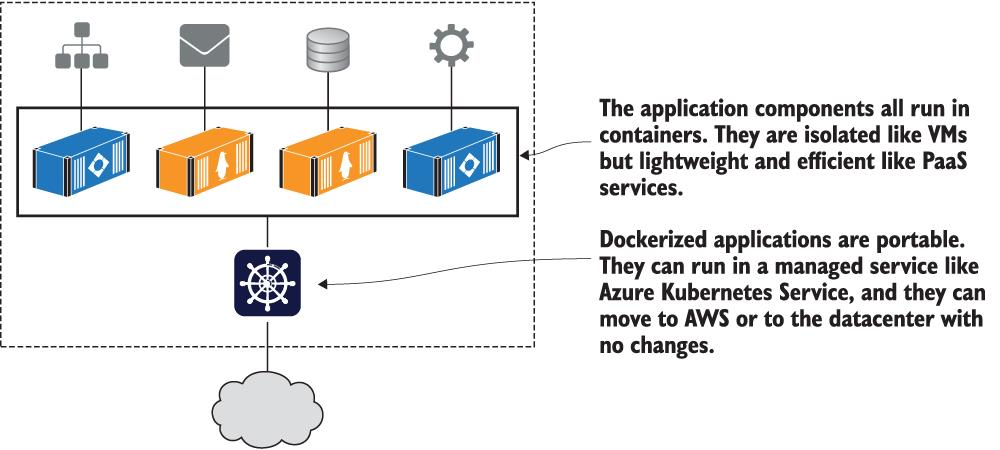
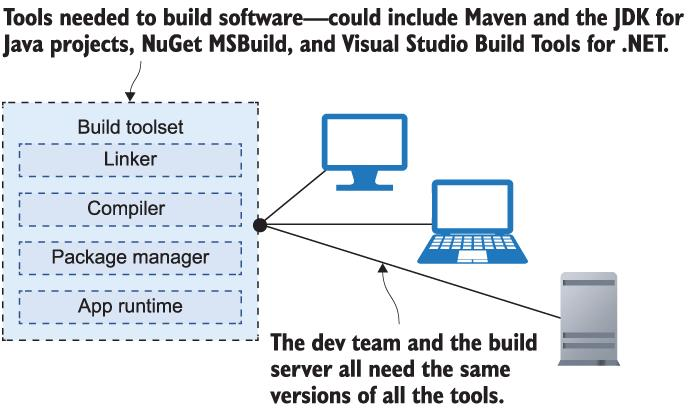
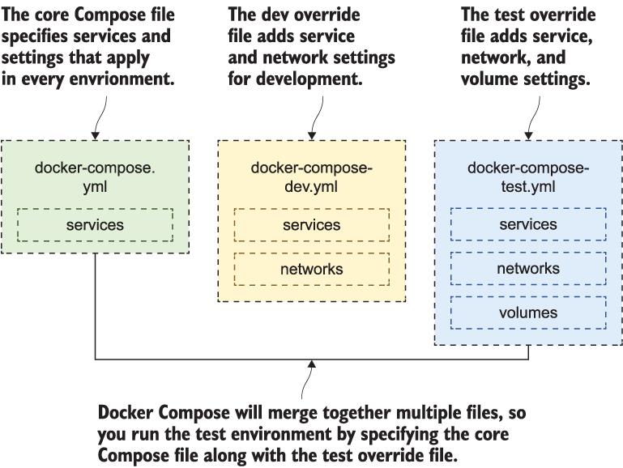

# Setup/teardown
See `book_code.md` and `cleanup.md`, respectively.

# Preface
* author started working with Docker in 2014

# Part 1: Understanding Docker containers and images

## Chapter 1: Before you begin
* links: http://mng.bz/04lW, http://mng.bz/K29E (note both have equivalents like https://shortener.manning.com/K29E)
* Docker: "cost benefits of PaaS with the portability benefits of IaaS"
* nontransportability (is that a word?) of lambda functions
  * Nuclio, OpenFaaS, or Fn Project, are all popular open source serverless frameworks
* Hyperledger
* "Operators may have a background in tools like Bash, Nagios, PowerShell, and System Center. Developers work in Make, Maven, NuGet, and MSBuild."
  * OK, haven't heard of Nagios, NuGet, and System Center; I know little about Maven.
* CALMS framework for implementing DevOps: Culture, Automation, Lean, Metrics, and Sharing
* Things he won't cover: `containerd`, `cgroups`, and `namespaces`. Does LFS cover all these? I'm kind of working my way backwards--or downwards, as it were!
  * nor the Windows Host Compute Service, for that matter
  * he recs *Docker in Action* (second edition) by Jeff Nickoloff and Stephen Kuenzli

One helpful image:


### Discussion notes
* "Benefits of a VM without the downside" says Yong.

## Chapter 2: Understanding Docker and running Hello World
* VMs: own OS; can use GB of RAM and lots of CPU
  * isolation at the cost of density
  * licensing costs; burden of OS updates
* Containers: share OS of computer running; makes them extremely lightweight
  * can have typically 5-10x as many as VMs on the same hardware
  * density, but apps are in own containers, so you also get isolation --> Docker is efficient!
* "You can try a new piece of software--say, Elasticsearch, or the latest version of SQL Server, or the Ghost blogging engine--with the same type of `docker container run` commands you’ve been using here."
* "...Universal Control Plane (UCP), a commercial product from the company behind Docker (https://docs.docker.com/ee/ucp/ --> archived [here](https://web.archive.org/web/20180721171151/https://docs.docker.com/ee/ucp/)). Portainer is another option, which is an open source project. Both UCP and Portainer run as containers themselves, so they’re easy to deploy and manage."
  * UCP is a graphical user interface for containers
* "containerd is an open source component overseen by the Cloud Native Computing Foundation, and the specification for running containers is open and public; it’s called the Open Container Initiative (OCI)."
* "Docker is by far the most popular and easy to use container platform, but it’s not the only one. You can confidently invest in containers without being concerned that you’re getting locked in to one vendor’s platform."

### Discussion notes
* We asked ChatGPT, "If a Docker instance doesn't have an OS, is it even possible to run a different OS in it?" and it answered, "Docker containers don't contain a full operating system; instead, they package only the necessary components and dependencies required to run a specific application. Docker containers share the host operating system's kernel and resources, which allows them to be lightweight and portable." & mentioned running a VM if we need a totally different OS. It also said, "Docker is designed to be used with containerized applications, and it's not meant for running full-fledged operating systems."

## Chapter 3: Building your own Docker images
* Docker images may be packaged with a default set of configuration values for the application, but you should be able to provide different configuration settings when you run a container.

## Chapter 4: Packaging applications from source code into Docker Images
* Regarding Figure 4.1 Everyone needs the same set of tools to build a software project.
  * a relevant problem experienced on a project at work just today! which is a funny contrast to other projects actively using Docker

* multi-stage Dockerfiles "have more than one `FROM` instruction, and the steps are laid out to get maximum benefit from Docker's image layer cache"
* does the `dependency:go-offline` mean that once this runs once, we no longer have to be connected? From [here](https://maven.apache.org/plugins/maven-dependency-plugin/go-offline-mojo.html), it seems to install all needed dependencies, so it would appear that way.
  * ChatGPT helped. I asked:
> explain like I'm a freshman in computer science (who knows how to write & compile Java code) what "mvn -B dependency:go-offline" means

...part of the answer:

> ...
> 
> * **go-offline**: This is the specific goal within the Dependency Plugin. When you execute this goal, Maven will download all the dependencies required for your project and store them in your local Maven repository. Going "offline" means that Maven will attempt to download all the necessary dependencies without connecting to the internet during subsequent builds, making your build process more self-contained.
> 
> In summary, when you run mvn -B dependency:go-offline, you are telling Maven to resolve and download all the dependencies for your project and store them locally, allowing you to build your project even when you don't have an internet connection. This is particularly useful in scenarios where you want to ensure that your build process can run independently of external network availability.
* "Docker itself is written in Go"
* "Multi-stage Dockerfiles make your project entirely portable. You might use Jenkins to build your apps right now, but you could try AppVeyor’s managed CI service or Azure DevOps without having to write any new pipeline code--they all support Docker, so your pipeline is just `docker image build`."

## Chapter 5: Sharing images with Docker Hub and other registries
* Instead of `docker.io/diamol/golang:latest` (URL listed early), I see `https://hub.docker.com/r/diamol/golang`. But maybe `docker.io` will work when pulling?
* "Layers are only physically uploaded to the registry if there isn’t an existing match for that layer's hash."
  * cool! but I also wonder if there have ever been collisions...
* Changed the steps slightly for bypassing restrictions on `registry.local:*`... Settings >> Resources >> Proxies & added under "bypass..."
* "use specific image tags for the base images in your own Dockerfiles"

### Discussion
```
λ docker images registry.local:5001/gallery/ui --format="{{ .Tag }}"
```
Outputs:
```
2
2.1
2.1.106
latest
```
### Discussion #2
* The concept of manifests was in the Lab solution, but not explained in the chapter.
  * it's basically metadata about an image: https://docs.docker.com/reference/cli/docker/manifest/
* We tried `docker manifest inspect diamol/golang` and looked at the output.
* local registry doesn't seem to work exactly the way the book presents it. that said, we searched the text for "5000" and it's only in chapters 3 (unrelated) and 5 (used as port). So we get the concepts & can move on!

## Chapter 6: Using Docker Volumes For Persistent Storage
* bind mounting to have any arbitrary folder path surfaced to your container (such as a network drive)
* From Section 6.5, "Every container has a single disk, which is a virtual disk that Docker pieces together from several sources. Docker calls this the union filesystem."

### Discussion notes
* clever the way the image layers are read-only, allowing for repeatability

# Part 2: Running distributed applications in containers
* "...use Docker and Docker Compose to define, run, and manage applications that run across multiple containers." --> CI pipeline; health checks/observability

## Chapter 7: Running multi-container apps with Docker Compose
* "Docker is ideally suited to running distributed applications--from n-tier monoliths to modern microservices."
* "[YAML] translates easily to JSON (which is the standard language for APIs)"
* Section 7.2 references the NASA APOD API app as an example: Java frontend (website), API in Go, and a Node log collector.
* Section 7.4 mentions [Sqlectron](https://sqlectron.github.io/).

### Section 7.5: Understanding the problem Docker Compose solves
* "Docker Compose is a very neat way of describing the setup for complex distributed apps in a small, clear file format. The Compose YAML file is effectively a deployment guide for your application, but it’s miles ahead of a guide written as a Word document."
* Docker Compose basically kicks things off, but that's where it ends.
* might want to look up Docker Swarm vs. Kubernetes

# Useful links
* Author's YouTube (link from Chapter 6 lab's README file): https://is.gd/z8qHga
* [Docker Compose Viz](https://github.com/pmsipilot/docker-compose-viz)

## Chapter 8: Supporting reliability with health checks and dependency checks
* advice: logic to ensure dependencies are met. but also fail-fast (sometimes better to have an exited container than a running (but failing) container)
* find the balance... health checks that work, but don't do too much work, as they need to run often

## Chapter 9: Adding observability with containerized monitoring
* exposing metrics from your app; use Prometheus to cllect them and Grafana for visualization
* custom metrics seem comparable to what we do with Datadog... but defined in JavaScript
* using PromQL --> again, similar to Datadog's query language
* links to [Google's Site Reliability Engineering book](http://mng.bz/EdZj)
  * "Their focus is on latency, traffic, errors, and saturation, which they call the 'golden signals.'"
* inspiring idea: summary dashboard(s) in Grafana & then display on a big screen in the office!

## Chapter 10: Running multiple environments with Docker Compose
* "Moving to Docker fixes that problem (drift) because every application is already packaged with its dependencies, but you still need the flexibility to support different behavior for different environments."
* Figure 10.4: Removing duplication with override files that add environment-specific settings:

* "Extension fields are custom definitions"... seems similar to terraform variables?

## Chapter 11: Building and testing applications with Docker and Docker Compose
* "In this chapter you’re going to learn how to do continuous integration (CI) with Docker."
* "There’s a huge choice of managed services you can choose from that all support Docker--you can mix and match GitHub with Azure DevOps and Docker Hub, or you could use GitLab, which provides an all-in-one solution. Or you can run your own CI infrastructure in Docker containers."

### Questions
- [ ] what exactly are .sock files?
- [ ] how do we apply digital signatures? (see figure 11.14 in section 11.5)

### Discussion notes
* Yong changed `"5000:5000"` to `"5001:5000"` in the docker-compose.yml file, and got it working.
* he did say the author specifies Jenkins version, but not all the dependencies work, so he had to make some modifications

# Part 3: Running at scale with a container orchestrator
* Docker Swarm - "a simple and powerful orchestrator built into Docker"

## Chapter 12: Understanding orchestration: Docker Swarm and Kubernetes
> "Services are first-class objects in Docker Swarm"... what does `first-class` mean in this context?

> I know it’s not good, but at least we got 12 chapters in before we hit the “this sucks on Windows” moment, and I don’t think there are any more coming.

* Good comparison of Docker Swarm vs. Kubernetes.

## Chapter 13: Deploying distributed applications as stacks in Docker Swarm
* the reality is you [should] interact with Docker Swarm via YAML, not individual/manual commands
* "Docker containers can access all the host machine’s CPU and memory if you don’t specify a limit"
* The juggling octopi are cute in [Figure 13.4](./attachments/Figure_13-4.jpg)!
* config objects are not meant for sensitive data
* secrets are encrupted for their lifetime in the cluster
* n.b., neither config objects nor secrets may be updated --> I do see a positive; having a commit and minor version increment for regular password updates.
  * ahh, but Kubernetes does let you update both; this is just a Docker Swarm "limitation"/feature


## Chapter 14: Automating releases with upgrades and rollbacks
* should have zero downtime for upgrades & ideally monthly alongside OS updates
* `mode: global` to ensure one replica on each node of the Swarm
* on rollbacks:
> There is no `docker stack rollback` command; only individual services can be rolled back to their previous state.
* https://labs.play-with-docker.com/

## Chapter 15: Configuring Docker for secure remote access and CI/CD
* I went through pretty quickly over lunch & like the concepts.
* PWD is a neat tool.

## Chapter 16
I read through before we met, but did not run any of the code. Conceptually straightforward; you *might* need to package your image for different architectures. That said, Buildx is a very useful tool that seems to be in wide use these days.

# Part 4: Getting your containers ready for production

## Chapter 17: Optimizing your Docker images for size, speed, and security
Optimize because...
> ...you do not want to be paged at 2 a.m. when your servers have run out of disk space.

>  It’s easy for your disk to get swallowed up with lots of old image layers, especially on development or test machines that are regularly updating.
Truth! I cleared some on my work machine recently & freed-up a LOT of space.

> Each instruction in a Dockerfile produces an image layer, and layers are merged together to form the whole image.

* Be careful to select a base image that suits your needs... the example shows `nanoserver` versions of OpenJDK images that are MUCH smaller, even for Windows.

> As a good rule, use Alpine or Debian Slim images as the base OS for Linux containers, and Nano Server for Windows containers (the alternative is Windows Server Core, which is pretty much the full Windows Server OS--that’s where the gigabytes of disk go).

...but that "not every app will work with the smaller variants, but it’s easy to switch images in your `FROM` lines and test it out."

Like the author says, the truth-app example is contrived... I found [this](https://redfoxsec.com/blog/introduction-to-docker-container-breakouts/) and [this](https://www.aquasec.com/cloud-native-academy/container-security/container-escape/) talking about container breakout/escape.

* alternatives to Anchore: Clair, Aqua

> You should always use explicit versions when you add packages to your image, so you know exactly what you’re running, and you can choose when to update.
* see use of `apt` commands and `ARG` instructions

### Section 17.5: Understanding why optimization counts
> You’ve seen in this chapter that you can follow some simple best practices and make your Dockerfiles a joy to work with. Those practices boil down to
> 
> * Choose the right base image--ideally curate your own set of golden images.
> * Use multi-stage Dockerfiles for all but the simplest apps.
> * Don’t add any unnecessary packages or files--focus on layer size.
> * Sort your Dockerfile instructions by change frequency--maximize the cache.

## Chapter 18: Application configuration management in containers
* Re: 12factor.net (see below):
  * "It’s a useful approach that helps you get into the mindset that containers are ephemeral because changing environment variables to set application config means replacing containers."
* "Node-config has a slightly unusual implementation: rather than specifying individual settings as environment variables, you need to provide the settings as a JSON-formatted string in the environment variable."
* risk of including sensitive settings in config files
* "Go has a popular configuration module called Viper" similar to the .NET Core libraries & node-config.
* Section 18.4 ends with, "We’ll wrap up this chapter with some thoughts on where that multi-tiered configuration model can take you."

### Questions/further reading:
- [ ] do folks at work recommend/use/reference https://12factor.net/?

## Chapter 19: Writing and managing application logs with Docker
### Section 19.3: Collecting & forwarding container logs
> Way back in chapter 2 I talked about how Docker adds a consistent management layer over all your apps--it doesn’t matter what’s happening inside the container; you start, stop, and inspect everything in the same way. That’s especially useful with logs when you bring a consolidated logging system into your architecture, and we’ll walk through one of the most popular open source examples of that: Fluentd.
> 
> Fluentd is a unified logging layer.
* run Fluentd in a container --> it will listen for logs from other containers that use the logging driver

> The model for centralized logging with a searchable data store and a user-friendly UI is one you should definitely consider when you’re getting containers ready for production.
* Alternatives to Fluentd include Graylog, Splunk. I would imagine New Relic and Datadog, too?

### Section 19.5: Understanding the container logging model
> We used the EFK stack in this chapter--Elasticsearch, Fluentd, and Kibana...

## Chapter 20: Controlling HTTP traffic to containers with a reverse proxy
* The intro is about how we've used a bunch of different ports to keep things separate, but for prod uses:
> You’ll want lots of applications running on a single cluster, but you need them all to be accessible on the standard HTTP and HTTPS ports, 80 and 443.
* We'll use Nginx and Traefik

> Reverse proxies are not a new technology, but they’ve shifted left with the container revolution.

* Section 20.3 covers use of nginx's cash

### Todos:
- [ ] explore https://www.ssllabs.com/

# Once complete:
- [ ] does LinkedIn have a Docker quiz?
- [ ] consider pursuing a certification
- [ ] maybe go through http://mng.bz/EdZj (see link in Chapter 9)
